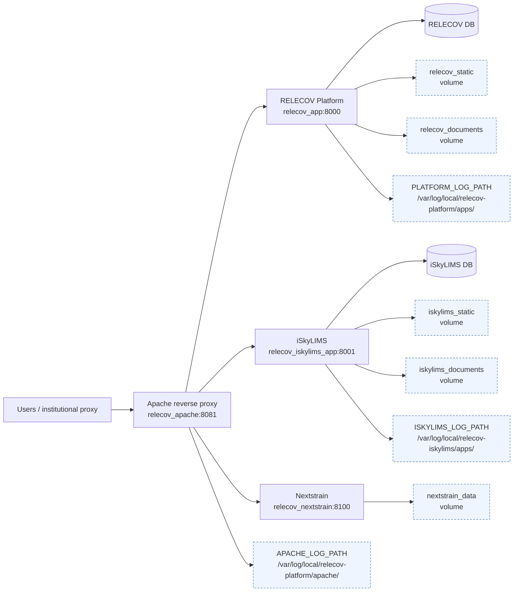

# RELECOV Platform

RELECOV Platform is the web application used to manage RELECOV metadata, validation, submissions, and integration workflows. The production container stack also includes iSkyLIMS for wet-lab/LIMS workflows, Nextstrain for dataset visualization, and an Apache reverse proxy that fronts the services.

- [RELECOV Platform](#relecov-platform)
  - [Infrastructure overview](#infrastructure-overview)
  - [Get the code (required)](#get-the-code-required)
  - [Choose your path](#choose-your-path)
  - [Minimum requirements](#minimum-requirements)
  - [Docker deployment](#docker-deployment)
    - [Local test stack](#local-test-stack)
    - [Production container stack](#production-container-stack)
      - [Service layout](#service-layout)
      - [Production configuration files](#production-configuration-files)
      - [Persist logs/documents on the host](#persist-logsdocuments-on-the-host)
      - [Apache reverse proxy (container) + Gunicorn](#apache-reverse-proxy-container--gunicorn)
      - [Manage containers after installation](#manage-containers-after-installation)
    - [Upgrade docker deployment](#upgrade-docker-deployment)
  - [Bare-metal deployment (Ubuntu/CentOS)](#bare-metal-deployment-ubuntucentos)
    - [Install](#install)
    - [Upgrade](#upgrade)
  - [Common operations (Docker + bare-metal)](#common-operations-docker--bare-metal)
    - [Database creation, users and grants](#database-creation-users-and-grants)
    - [Backups](#backups)
    - [Restore / rollback](#restore--rollback)
    - [What to do if something fails](#what-to-do-if-something-fails)
  - [Post-install configuration](#post-install-configuration)
    - [RELECOV Platform](#relecov-platform-1)
    - [iSkyLIMS](#iskylims)
    - [Nextstrain](#nextstrain)
    - [Smoke test](#smoke-test)
  - [Developer notes](#developer-notes)
    - [Django migrations workflow](#django-migrations-workflow)
    - [Persistent host paths](#persistent-host-paths)
    - [Configure Apache server](#configure-apache-server)

For problems or bug reports, open an issue in the project repository.

## Infrastructure overview

The integrated container stack is designed to run the RELECOV Platform application together with the services it depends on operationally:

- **RELECOV Platform**: Django/Gunicorn application, default runtime path `/opt/relecov-platform`, internal port `8000`.
- **iSkyLIMS**: Django/Gunicorn LIMS application checked out next to this repository as `../relecov-iskylims`, default runtime path `/opt/iskylims`, internal port `8001`.
- **Nextstrain**: `nextstrain/base` container running `nextstrain view`, internal port `8100`.
- **Apache**: UBI httpd container that reverse-proxies external traffic to the three services and serves static/documents volumes.
- **External database**: production deployments use existing MySQL/MariaDB databases configured in each service install config.



## Get the code (required)

All integrated container commands assume `relecov-platform` and `relecov-iskylims` are checked out side-by-side:

```bash
git clone https://github.com/BU-ISCIII/relecov-platform.git relecov-platform
git clone https://github.com/BU-ISCIII/iskylims.git relecov-iskylims
cd relecov-platform
```

Expected layout:

```text
relecov-platform-all/
|-- relecov-platform/
`-- relecov-iskylims/
```

## Choose your path

- **Docker (local test)**: starts a MySQL test database, RELECOV Platform, iSkyLIMS, and Nextstrain.
- **Docker (production container stack)**: deploys RELECOV Platform, iSkyLIMS, Nextstrain, and Apache containers against external production databases.
- **Bare-metal**: installs or upgrades the RELECOV Platform application directly on a host with `install.sh`; iSkyLIMS must be installed separately from its own repository.

## Minimum requirements

Container deployment requirements:

- Docker Engine + Docker Compose v2, or Podman + `podman-compose`
- git >= 2.34
- Side-by-side `relecov-platform` and `relecov-iskylims` checkouts
- For production containers: access to external MySQL/MariaDB databases for both RELECOV Platform and iSkyLIMS
- Host directories and permissions for logs and Apache config, described in [Persist logs/documents on the host](#persist-logsdocuments-on-the-host)

Bare-metal deployment requirements:

- sudo privileges for dependency installation
- MySQL >= 8.0 or MariaDB > 10.4
- Apache >= 2.4
- git >= 2.34
- Python >= 3.11
- `rsync`, `wget`, `curl`, `tar`
- `lsb_release` package:
  - RedHat/CentOS: `yum install redhat-lsb-core`
  - Ubuntu: `apt install lsb-core lsb-release`

## Docker deployment

### Local test stack

The local test stack starts:

- `relecov_test_db` (MySQL)
- `relecov_test_app` (RELECOV Platform)
- `relecov_test_iskylims_app` (iSkyLIMS)
- `relecov_test_nextstrain` (Nextstrain viewer)

Run the default test deployment:

```bash
bash container_install.sh --test 2>&1 | tee relecov_test_install.log
```

Use Podman explicitly:

```bash
bash container_install.sh --test --engine podman 2>&1 | tee relecov_test_install.log
```

The test compose file publishes the application ports directly:

- RELECOV Platform: `http://localhost:8000`
- iSkyLIMS: `http://localhost:8001`
- Nextstrain: `http://localhost:8100`

Useful options:

- `--git_revision current` to build from the copied local working tree without checking out a branch in-container.
- `--skip_test_data` to skip loading test fixtures.
- `--script`, `--script_before`, and `--script_after` to run Django migration scripts through `install.sh`.
- `--install_conf_map service,path` to pass service-specific settings files.

Example with explicit service config mapping:

```bash
bash container_install.sh --test --engine podman \
  --install_conf_map app,conf/docker_test_settings.txt \
  --install_conf_map iskylims_app,../relecov-iskylims/conf/docker_test_settings.txt \
  2>&1 | tee relecov_test_install.log
```

### Production container stack

Production deployment uses `docker-compose.prod.yml` by default. It runs:

- `relecov_apache`
- `relecov_app`
- `relecov_iskylims_app`
- `relecov_nextstrain`

The application containers are built with staged application trees baked into the image. Host reboots or container recreation do not require rerunning app file installation; `container_install.sh` runs runtime bootstrap tasks such as migrations, optional scripts, superuser creation on first install, and static collection.

#### Service layout

The production compose file exposes only Apache on the host:

- Host port `APACHE_HOST_PORT` (default `8090`) -> Apache container port `8081`
- RELECOV Platform is internal on service `app:8000`
- iSkyLIMS is internal on service alias `iskylimsapp:8001`
- Nextstrain is internal on service `nextstrain:8100`

Access normally goes through the Apache virtual hosts rendered from `conf/relecov_apache_reverse_proxy.conf`. The default service names are:

- RELECOV Platform: `RELECOV_PLATFORM_SERVER_NAME`, or `DNS_URL` from the platform install config, or `relecov-platform.isciiides.es`
- iSkyLIMS: `RELECOV_ISKYLIMS_SERVER_NAME`, default `relecov-iskylims.isciiides.es`
- Nextstrain: `RELECOV_NEXTSTRAIN_SERVER_NAME`, default `nextstrain.isciiides.es`

#### Production configuration files

Prepare one config per Django service:

```bash
cp conf/docker_production_settings.txt conf/my_prod_settings_relecov.txt
cp ../relecov-iskylims/conf/docker_production_settings.txt ../relecov-iskylims/conf/my_prod_settings_iskylims.txt
```

Edit both files with the correct database, email, DNS, and local server values.

Deploy:

```bash
bash container_install.sh --engine podman \
  --action install \
  --install_conf_map app,conf/my_prod_settings_relecov.txt \
  --install_conf_map iskylims_app,../relecov-iskylims/conf/my_prod_settings_iskylims.txt \
  2>&1 | tee relecov_prod_install_$(date +%Y%m%d_%H%M%S).log
```

Use Docker instead of Podman by omitting `--engine podman` or passing `--engine docker`.

Container build/runtime values are configured through the selected install configs and environment. Important production variables:

- `APP_INSTALL_PATH`: platform runtime install root. Default: `/opt/relecov-platform`.
- `APACHE_CONF_PATH`: host directory for rendered Apache config files. Default: `/srv/containers/bind/relecov-platform/relecov_apache_conf`.
- `DJANGO_SETTINGS_PATH`: host file bind-mounted as `${APP_INSTALL_PATH}/relecov_platform/settings.py`. Default: `/srv/containers/bind/relecov-platform/relecov_django_setting/settings.py`.
- `APACHE_LOG_PATH`: host directory mounted as `/var/log/httpd` in Apache. Default: `/var/log/local/relecov-platform/apache`.
- `PLATFORM_LOG_PATH`: host directory mounted as platform logs. Default: `/var/log/local/relecov-platform/apps`.
- `ISKYLIMS_LOG_PATH`: host directory mounted as iSkyLIMS logs. Default: `/var/log/local/relecov-iskylims/apps`.
- `RELECOV_PLATFORM_SERVER_NAME`, `RELECOV_ISKYLIMS_SERVER_NAME`, `RELECOV_NEXTSTRAIN_SERVER_NAME`: Apache virtual host names.
- `SERVER_STATUS_SERVER_NAME`, `SERVER_STATUS_ALIASES`, `SERVER_STATUS_ALLOW_FROM`: Apache `/server-status` rendering values.
- `APP_UID` / `APP_GID`: runtime UID/GID for Django containers. Default: `1212:1212`.
- `WEB_CONCURRENCY`, `GUNICORN_THREADS`, `GUNICORN_TIMEOUT`, `GUNICORN_KEEPALIVE`: Gunicorn tuning values.

During production install/upgrade, `container_install.sh` writes `.env.prod.file` in the repository root. This file is ignored by git and used by Compose for variable interpolation in `docker-compose.prod.yml`.

#### Persist logs/documents on the host

Production persistence layout:

- `${APACHE_CONF_PATH:-/srv/containers/bind/relecov-platform/relecov_apache_conf}/relecov_apache_reverse_proxy.conf` -> `/etc/httpd/conf.d/01-relecov.conf`
- `${APACHE_CONF_PATH:-/srv/containers/bind/relecov-platform/relecov_apache_conf}/relecov_apache_logs.conf` -> `/etc/httpd/conf.d/00-logformat.conf`
- `${APACHE_CONF_PATH:-/srv/containers/bind/relecov-platform/relecov_apache_conf}/relecov_apache_server-status.conf` -> `/etc/httpd/conf.d/02-server-status.conf`
- `${DJANGO_SETTINGS_PATH:-/srv/containers/bind/relecov-platform/relecov_django_setting/settings.py}` -> `${APP_INSTALL_PATH:-/opt/relecov-platform}/relecov_platform/settings.py`
- `${APACHE_LOG_PATH:-/var/log/local/relecov-platform/apache}` -> `/var/log/httpd`
- `${PLATFORM_LOG_PATH:-/var/log/local/relecov-platform/apps}` -> `${APP_INSTALL_PATH:-/opt/relecov-platform}/logs`
- `${ISKYLIMS_LOG_PATH:-/var/log/local/relecov-iskylims/apps}` -> `${ISKYLIMS_INSTALL_PATH:-/opt/iskylims}/logs`
- `relecov_documents` named volume -> `${APP_INSTALL_PATH:-/opt/relecov-platform}/documents`
- `relecov_static` named volume -> `${APP_INSTALL_PATH:-/opt/relecov-platform}/static`
- `iskylims_documents` named volume -> `${ISKYLIMS_INSTALL_PATH:-/opt/iskylims}/documents`
- `iskylims_static` named volume -> `${ISKYLIMS_INSTALL_PATH:-/opt/iskylims}/static`
- `nextstrain_data` named volume -> `/data` in the Nextstrain container

`container_install.sh` creates and fixes permissions for the standard host log/config paths. For locked-down hosts, pre-create them:

```bash
sudo mkdir -p /srv/containers/bind/relecov-platform/relecov_apache_conf
sudo mkdir -p /srv/containers/bind/relecov-platform/relecov_django_setting
sudo mkdir -p /var/log/local/relecov-platform/apache
sudo mkdir -p /var/log/local/relecov-platform/apps
sudo mkdir -p /var/log/local/relecov-iskylims/apps
sudo chown -R "$USER:$USER" /srv/containers/bind/relecov-platform/relecov_apache_conf /srv/containers/bind/relecov-platform/relecov_django_setting /var/log/local/relecov-platform /var/log/local/relecov-iskylims
```

For rootless Podman, the installer uses `podman unshare` fallback operations where normal `chmod`/`chown` cannot adjust rootless container ownership.

To repair host bind mounts and mounted app volumes without rebuilding:

```bash
bash container_install.sh --engine podman \
  --action fix-permissions \
  --install_conf_map app,conf/my_prod_settings_relecov.txt \
  --install_conf_map iskylims_app,../relecov-iskylims/conf/my_prod_settings_iskylims.txt
```

#### Apache reverse proxy (container) + Gunicorn

In production:

- `relecov_app` runs RELECOV Platform with Gunicorn.
- `relecov_iskylims_app` runs iSkyLIMS with Gunicorn.
- `relecov_nextstrain` runs `nextstrain view /data`.
- `relecov_apache` reverse-proxies external requests and serves static/document volumes.

Apache config files are rendered from:

- `conf/relecov_apache_reverse_proxy.conf`
- `conf/relecov_apache_logs.conf`
- `conf/relecov_apache_server-status.conf`

The rendered files are copied to `APACHE_CONF_PATH` before Compose starts the Apache container. Runtime Apache logs are written to `APACHE_LOG_PATH`.

Both settings files define the forwarded scheme and port. The integrated `relecov_apache` proxy reads the RELECOV Platform values; standalone iSkyLIMS reads the iSkyLIMS values:

```bash
APACHE_FORWARDED_PROTO='https'
APACHE_FORWARDED_PORT='443'
```

#### Manage containers after installation

After a production install, use the generated `.env.prod.file` whenever you run Compose directly. This keeps install paths, log paths, UID/GID values, ports, server names, and Gunicorn settings aligned with the values rendered by `container_install.sh`.

Docker:

```bash
docker compose --env-file .env.prod.file -f docker-compose.prod.yml ps
docker compose --env-file .env.prod.file -f docker-compose.prod.yml logs --tail 200 apache
docker compose --env-file .env.prod.file -f docker-compose.prod.yml logs --tail 200 app
docker compose --env-file .env.prod.file -f docker-compose.prod.yml logs --tail 200 iskylims_app
docker compose --env-file .env.prod.file -f docker-compose.prod.yml logs --tail 200 nextstrain
docker compose --env-file .env.prod.file -f docker-compose.prod.yml restart app
docker compose --env-file .env.prod.file -f docker-compose.prod.yml up -d
```

Podman:

```bash
podman compose --env-file .env.prod.file -f docker-compose.prod.yml ps
podman compose --env-file .env.prod.file -f docker-compose.prod.yml logs --tail 200 apache
podman compose --env-file .env.prod.file -f docker-compose.prod.yml logs --tail 200 app
podman compose --env-file .env.prod.file -f docker-compose.prod.yml logs --tail 200 iskylims_app
podman compose --env-file .env.prod.file -f docker-compose.prod.yml logs --tail 200 nextstrain
podman compose --env-file .env.prod.file -f docker-compose.prod.yml restart app
podman compose --env-file .env.prod.file -f docker-compose.prod.yml up -d
```

If you edit container runtime values in the install config, rerun `container_install.sh` with the same `--install_conf_map` values so `.env.prod.file` and the running containers are regenerated consistently.

### Upgrade docker deployment

Use `upgrade` when databases and volumes already exist.

Before upgrading, perform backups from [Backups](#backups).

```bash
bash container_install.sh --engine podman \
  --action upgrade \
  --install_conf_map app,conf/my_prod_settings_relecov.txt \
  --install_conf_map iskylims_app,../relecov-iskylims/conf/my_prod_settings_iskylims.txt \
  2>&1 | tee relecov_prod_upgrade_$(date +%Y%m%d_%H%M%S).log
```

The upgrade path rebuilds/restarts the containers and runs `install.sh --bootstrap upgrade` inside each Django service container. The bootstrap phase applies migrations with `--fake-initial`, refreshes static files, and skips first-install test/demo data.

## Bare-metal deployment (Ubuntu/CentOS)

### Install

1. Prepare DB/users/grants from [Database creation, users and grants](#database-creation-users-and-grants).
2. Edit `conf/install_settings.txt` or copy `conf/template_install_settings.txt` to a site-specific config.
3. Run the installer:

```bash
bash install.sh --install full --conf conf/install_settings.txt
```

iSkyLIMS is a separate application. For bare-metal deployments, install it from `../relecov-iskylims` using its README and `install.sh`.

### Upgrade

Before upgrading, perform backups from [Backups](#backups).

```bash
bash install.sh --upgrade app --conf conf/install_settings.txt
```

## Common operations (Docker + bare-metal)

### Database creation, users and grants

Run as MySQL/MariaDB root and adapt names/passwords to your deployment:

```sql
CREATE DATABASE IF NOT EXISTS relecov_dev CHARACTER SET utf8mb4 COLLATE utf8mb4_unicode_ci;
CREATE DATABASE IF NOT EXISTS iskylims_rel_dev CHARACTER SET utf8mb4 COLLATE utf8mb4_unicode_ci;

CREATE USER IF NOT EXISTS 'relecov'@'%' IDENTIFIED BY 'djangopass';
CREATE USER IF NOT EXISTS 'relecovlims'@'%' IDENTIFIED BY 'djangopass';

CREATE USER IF NOT EXISTS 'relecov'@'localhost' IDENTIFIED BY 'djangopass';
CREATE USER IF NOT EXISTS 'relecovlims'@'localhost' IDENTIFIED BY 'djangopass';

GRANT ALL PRIVILEGES ON relecov_dev.* TO 'relecov'@'%';
GRANT ALL PRIVILEGES ON relecov_dev.* TO 'relecov'@'localhost';

GRANT ALL PRIVILEGES ON iskylims_rel_dev.* TO 'relecovlims'@'%';
GRANT ALL PRIVILEGES ON iskylims_rel_dev.* TO 'relecovlims'@'localhost';

FLUSH PRIVILEGES;
```

Verification:

```sql
SHOW GRANTS FOR 'relecov'@'%';
SHOW GRANTS FOR 'relecovlims'@'%';
```

### Backups

Database dumps:

```bash
mysqldump -h <db_host> -P <db_port> -u relecov -p relecov_dev > relecov_dev_$(date +%Y%m%d_%H%M%S).sql
mysqldump -h <db_host> -P <db_port> -u relecovlims -p iskylims_rel_dev > iskylims_rel_dev_$(date +%Y%m%d_%H%M%S).sql
```

Host logs:

```bash
tar -czf relecov_platform_logs_$(date +%Y%m%d_%H%M%S).tgz -C /var/log/local/relecov-platform/apps .
tar -czf relecov_iskylims_logs_$(date +%Y%m%d_%H%M%S).tgz -C /var/log/local/relecov-iskylims/apps .
tar -czf relecov_apache_logs_$(date +%Y%m%d_%H%M%S).tgz -C /var/log/local/relecov-platform/apache .
```

Named volumes:

```bash
podman run --rm -v relecov_documents:/from -v "$PWD":/to alpine \
  tar -czf /to/relecov_documents_$(date +%Y%m%d_%H%M%S).tgz -C /from .

podman run --rm -v iskylims_documents:/from -v "$PWD":/to alpine \
  tar -czf /to/iskylims_documents_$(date +%Y%m%d_%H%M%S).tgz -C /from .

podman run --rm -v nextstrain_data:/from -v "$PWD":/to alpine \
  tar -czf /to/nextstrain_data_$(date +%Y%m%d_%H%M%S).tgz -C /from .
```

Suggested backup order before risky changes:

1. Database dumps.
2. Documents volumes.
3. Nextstrain datasets volume.
4. Logs archive.

### Restore / rollback

Restore databases:

```bash
mysql -h <db_host> -P <db_port> -u relecov -p relecov_dev < relecov_dev_YYYYMMDD_HHMMSS.sql
mysql -h <db_host> -P <db_port> -u relecovlims -p iskylims_rel_dev < iskylims_rel_dev_YYYYMMDD_HHMMSS.sql
```

Restore named volumes:

```bash
podman run --rm -v relecov_documents:/to -v "$PWD":/from alpine \
  sh -lc "cd /to && tar -xzf /from/relecov_documents_YYYYMMDD_HHMMSS.tgz"

podman run --rm -v iskylims_documents:/to -v "$PWD":/from alpine \
  sh -lc "cd /to && tar -xzf /from/iskylims_documents_YYYYMMDD_HHMMSS.tgz"

podman run --rm -v nextstrain_data:/to -v "$PWD":/from alpine \
  sh -lc "cd /to && tar -xzf /from/nextstrain_data_YYYYMMDD_HHMMSS.tgz"
```

Restore logs archive:

```bash
sudo mkdir -p /var/log/local/relecov-platform/apps /var/log/local/relecov-platform/apache /var/log/local/relecov-iskylims/apps
sudo tar -xzf relecov_platform_logs_YYYYMMDD_HHMMSS.tgz -C /var/log/local/relecov-platform/apps
sudo tar -xzf relecov_iskylims_logs_YYYYMMDD_HHMMSS.tgz -C /var/log/local/relecov-iskylims/apps
sudo tar -xzf relecov_apache_logs_YYYYMMDD_HHMMSS.tgz -C /var/log/local/relecov-platform/apache
```

### What to do if something fails

Quick checks:

```bash
podman ps -a
podman logs --tail 200 relecov_apache
podman logs --tail 200 relecov_app
podman logs --tail 200 relecov_iskylims_app
podman logs --tail 200 relecov_nextstrain
```

Check Django from inside the app containers:

```bash
podman exec -it relecov_app python /opt/relecov-platform/manage.py check
podman exec -it relecov_iskylims_app python /opt/iskylims/manage.py check
```

If deployment is broken after migration or bad data load, rollback using [Restore / rollback](#restore--rollback).

## Post-install configuration

### RELECOV Platform

1. Create the admin/superuser if not already created.
2. Load RELECOV schema in `Configuration -> SchemaHandling`, using the latest `relecov_schema.json`:
   `https://raw.githubusercontent.com/BU-ISCIII/relecov-tools/main/relecov_tools/schema/relecov_schema.json`
3. Load annotation GFF in `Configuration -> Annotation`:
   `conf/NC_045512.2.gff`
4. Verify the iSkyLIMS endpoint in `/admin/core/configsetting/`.
   For containers, point `ISKYLIMS_SERVER` to the iSkyLIMS service DNS name reachable from the platform container, for example `http://iskylimsapp:8001` or the Apache virtual host URL used in production.

### iSkyLIMS

Pre-load RELECOV sample project data before normal usage:

```bash
cd /opt/iskylims
source virtualenv/bin/activate
python manage.py migrate --noinput
python manage.py loaddata /path/to/relecov_iskylims_projects.json
```

If you need to generate that fixture from an existing environment:

```bash
cd /opt/iskylims
source virtualenv/bin/activate
python manage.py dumpdata --indent 2 core.SampleProjects > ~/relecov_iskylims_test_data.json
```

Then configure RELECOV in iSkyLIMS:

1. Create `relecovbot` in `/admin/auth/user/` and assign required permissions/groups for your integration flows.
2. Go to WetLab (`/wetlab`) and open `PARAMETERS SETTINGS -> Define Sample projects`.
3. If the project does not exist, create one including `RELECOV` in the name and set the manager.
4. In that RELECOV project, open `Define fields -> Load batch`, then set:
   - `upload schema`: `relecov_schema.json`
   - `Property where to fetch fields`: `classification`
   - select classifications to import:
     - Database Identifiers
     - Files info
     - Host information
     - Pathogen diagnostic testing
     - Sample collection and processing
     - Sequencing
5. Configure ontology mapping in `/admin/core/ontologymap/`:
   - `lab_request` -> `GENEPIO:0001153` (submitting_institution)
   - `species` -> `GENEPIO:0001386` (Organism)
   - `sample_name` -> `GENEPIO:0001123` (sequencing_sample_id)
   - `sample_entry_date` -> `NCIT:C93644` (received_date)
   - `collection_sample_date` -> `GENEPIO:0001174` (sample_collection_date)
6. Define species in `PARAMETERS SETTINGS -> Initial Settings -> Define new Specie`.
   Add all enum values used by your schema for `Organism`, for example:
   - Severe acute respiratory syndrome coronavirus 2
   - Respiratory syncytial virus
   - Influenza virus
7. Ensure `wetlab` app assignment is enabled for the related flow.

### Nextstrain

The production stack runs:

```bash
nextstrain view /data --port 8100 --host 0.0.0.0
```

Datasets must be present in the `nextstrain_data` named volume, mounted as `/data` inside the container. Copy or generate the expected Auspice dataset files into that volume before exposing the service to users.

Example copy using a temporary container:

```bash
podman run --rm -v nextstrain_data:/data -v "$PWD":/src alpine \
  sh -lc "cp -r /src/nextstrain-data/* /data/"
```

### Smoke test

Production checks through Apache depend on your virtual host names. Examples:

```bash
curl -I -H "Host: relecov-platform.isciiides.es" http://<host>:8090
curl -I -H "Host: relecov-iskylims.isciiides.es" http://<host>:8090
curl -I -H "Host: nextstrain.isciiides.es" http://<host>:8090
```

Direct container-level checks:

```bash
podman exec -it relecov_app python /opt/relecov-platform/manage.py check
podman exec -it relecov_iskylims_app python /opt/iskylims/manage.py check
podman logs --tail 100 relecov_nextstrain
```

## Developer notes

### Django migrations workflow

Migrations are committed to the repo. Do not run `makemigrations` during install/upgrade.

Baseline + upgrade flow for new releases:

1. Generate baseline migrations from the last stable tag.
2. Commit the baseline migrations.
3. Generate new migrations on the development branch for schema changes and commit them.
4. Upgrades run `migrate --fake-initial` once to align existing tables, then `migrate` to apply the new migration files.

### Persistent host paths

See [Persist logs/documents on the host](#persist-logsdocuments-on-the-host) in the production deployment section.

### Configure Apache server

These steps apply to bare-metal Apache installations. Docker production deployments use the `apache` container described above and do not require copying configs into `/etc/apache2` or `/etc/httpd`.

Copy the Apache configuration file according to your distribution inside the Apache configuration directory and rename it to `relecov-platform.conf`.

Typical config locations:

- Ubuntu/Debian: `/etc/apache2/sites-available/relecov-platform.conf` (enable with `a2ensite`)
- CentOS/RHEL: `/etc/httpd/conf.d/relecov-platform.conf`

Suggested steps (host Apache as reverse proxy):

1. Copy the example config:

    ```bash
    sudo cp conf/relecov_apache_ubuntu.conf /etc/apache2/sites-available/relecov-platform.conf
    # CentOS/RHEL:
    # sudo cp conf/relecov_apache_centos_redhat.conf /etc/httpd/conf.d/relecov-platform.conf
    ```

2. Edit the config:

    - Set `ServerName`
    - Ensure the WSGI paths point to the selected RELECOV Platform install path
    - Ensure `Alias /static/` points to the selected static directory

3. Create the static folder on the host:

    ```bash
    sudo mkdir -p /opt/relecov-platform/static
    ```

4. Enable required modules (Ubuntu/Debian):

    ```bash
    sudo a2enmod wsgi headers
    sudo a2ensite relecov-platform.conf
    ```

5. Reload Apache:

    ```bash
    sudo systemctl reload apache2
    # CentOS/RHEL:
    # sudo systemctl reload httpd
    ```
