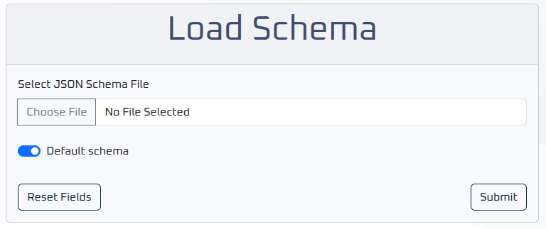
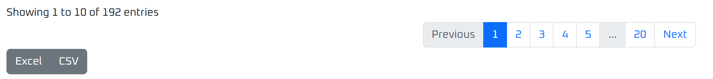
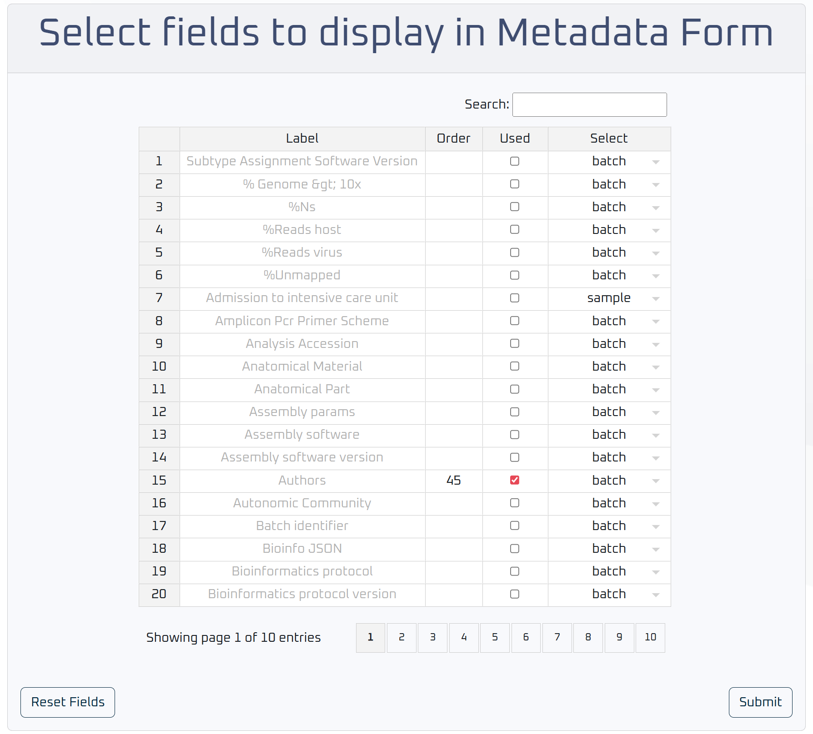
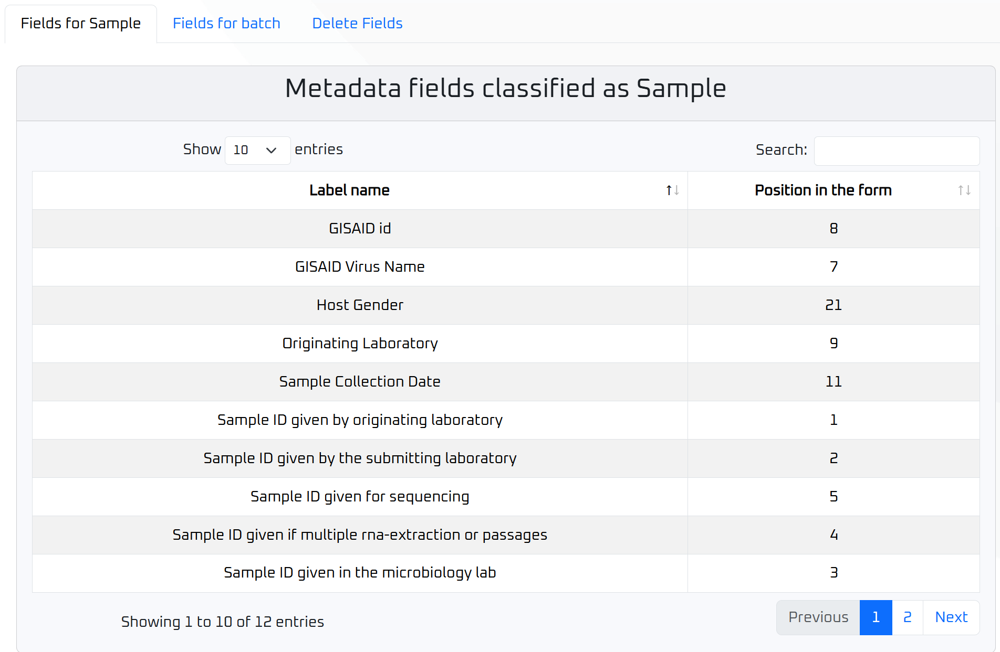
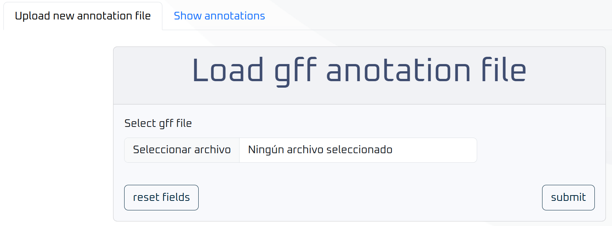
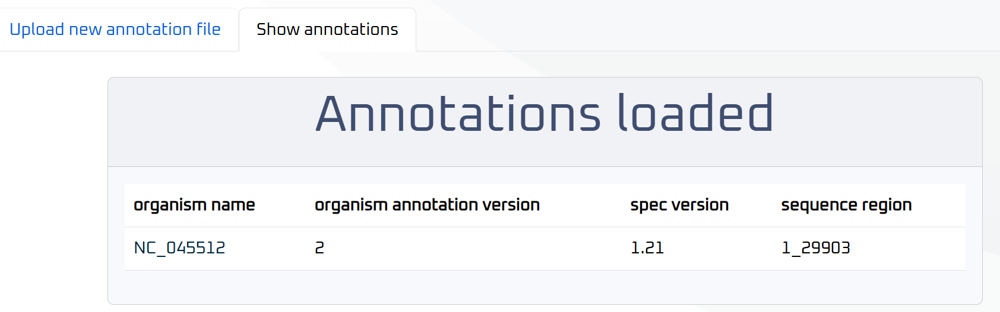
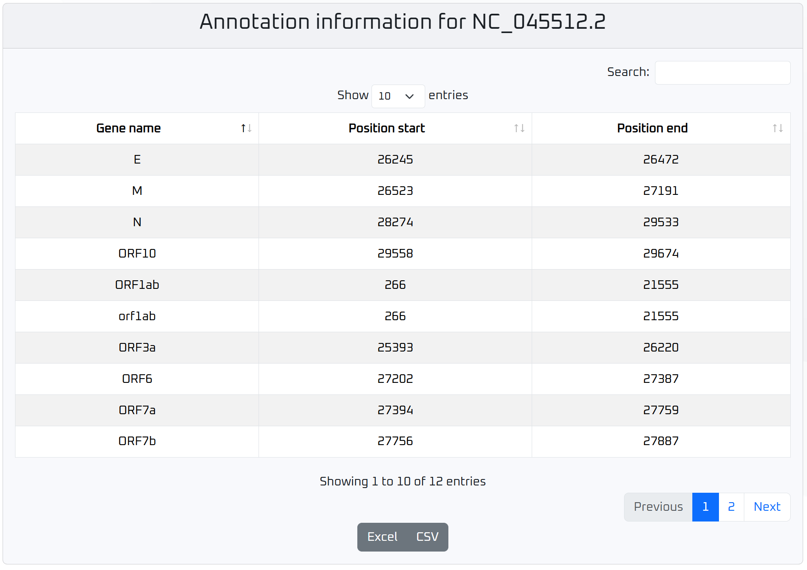
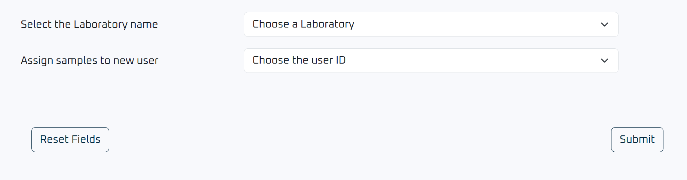

# Configuration

After running the installation script and applying the settings, the Relecov server is up and running, so anyone who accesses the Relecov URL can see its homepage. However, at this point there is no information or options to start uploading data.

The admin user must perform a few more steps to create the basic environment before other users can use the application.

Log in as **admin** to see the **Configuration** menu.

> **Note:** This menu is only available when logged in as **admin**.

When you click on the **Configuration** tab, you will see several options that we describe below.

## Table of Contents

- [Configuration](#configuration)
  - [Table of Contents](#table-of-contents)
  - [Schema Management](#schema-management)
    - [Upload new Schema](#upload-new-schema)
    - [Show schemas](#show-schemas)
  - [Metadata Visualization](#metadata-visualization)
  - [Annotation](#annotation)
  - [Assign Institution to User](#assign-institution-to-user)
    - [Usage Notes](#usage-notes)

---

## Schema Management

### Upload new Schema

The first step is to upload the Relecov schema into the database.

For your convenience, we have kept the latest schema file in the `conf/` folder. Of course you can upload your own schema, but be aware that this may cause issues because, although the Relecov platform is designed to be flexible, we have not tested every scenario.

In the form, select the **Relecov schema file** and click **Default schema** to mark it as the default settings.

You can define as many schemas as you wish, but **only one can be the default** from which information is filled.

Please, be patient, the upload process may take some time.

### Show schemas

Once a schema is loaded, click the **Show Schemas** tab to view all schemas defined in your system.

Each schema can be downloaded in JSON format by clicking its download button.

To see detailed information about a particular schema, click its name to open a table of all properties defined for that schema.

Use the search field to find a specific property, or sort any column by clicking the small arrows in the header.

To export the table, use the **Excel** or **CSV** buttons at the bottom.

## Metadata Visualization

Next, define the metadata fields. The purpose of this tab is to give the user a clear and visual way to tailor the metadata form to the workflow by choosing only the fields needed and arranging them in the most logical order.

From the top menu, navigate to **Configuration → Metadata Visualization**. Here you can choose which fields from your JSON schema will appear in the metadata upload form and in which order. When you open this tab you'll see:

1. An **interactive spreadsheet**:
   - **Label**: the field name as defined in the schema.  
   - **Order**: the position it will occupy in the form.  
   - **Used**: a checkbox to include or exclude the field.  
   - **Select**: a dropdown to classify each field as "sample" (per-sample value) or "batch" (common to the entire batch).

2. **Controls**:
   - **Reset Fields**: revert to the default configuration (before any changes).  
   - **Submit**: save your settings.

**After saving the selection** three different tabs appear under Metadata Visualzation:

- **Fields for Sample**: Shows which fields will be shown for individual samples.
- **Fields for Batch**: Shows which fields will be shown for the batch as a whole.
- **Delete Fields**: `DELETE` button lets you completely clear the current configuration and start over.

## Annotation

This section of the configuration lets the user upload and browse General Feature Format (GFF) annotation files.

1. **Upload New Annotation File**  
   - Presents a simple file‐picker form that accepts `.gff` or `.gf3` files.  
   - When clicking in **Submit**, the chosen file is sent to the server and parsed into the annotation database.  
   - On success or error, a notification card appears at the top of the page.

2. **Show Annotations**  
   - Displays a table of all annotation files already loaded into the system.  
   - Columns include:  
     - **Organism name**: With clickable link to view anhnotation details (with export possibilities)
     - **Annotation version**
     - **Spec version**
     - **Sequence region**: start-nucleotide_end-nucleotide

This is how the annotation information is displayed:

## Assign Institution to User

This section provides a simple interface for administrators to assign one or more institutions (laboratories, hospitals...) to a specific user.

**Assignment Form**: You’ll see a form with two dropdowns:

- **Laboratory**: Select from the list of available institutions.
- **User**: Choose the user ID to whom the selected institution's samples should be assigned.

### Usage Notes

- Only users with administrative privileges can access this page.
- The form validates that both a lab and a user have been selected before submission.

