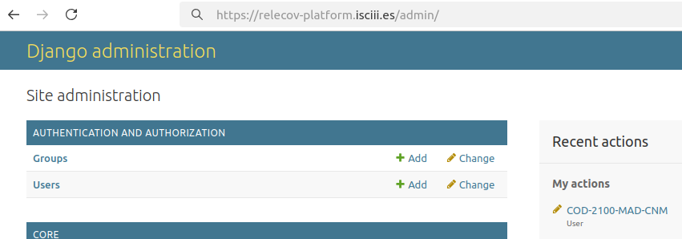

# How to create an user account

Only an **admin user** is allowed to create new user accounts.

If you are a regular user, please contact your manager to request an account.

> ⚠️ The following steps can only be performed by a user logged in as an **admin**.

---

## Access the Admin Panel

In your web browser, add `/admin` to the main URL of your Relecov application to access the administration environment.

For example:
```
http://relecov.org/admin
```

Under the "Site administration" area on Users row click on "+ Add" link.


In the left panel we will click on **Users**:


In the main panel, you will see a table displaying all users registered in the application. At this point, it should only show the administrator account created in a previous step.

To add a new user we will click on the **Add user** button.

Fill username and password fields correctly and click on **SAVE** button.


After clicking **SAVE**, a new form will appear where you can enter more detailed information about the user and manage their permissions.

**Personal information:**
   -  First name
   -  Last name
   -  Email address

**Permissions:**
- **Active**: Designates whether this user should be treated as active.  
- **Staff status**: Designates whether the user can log into the admin site.  
- **Superuser status**: Grants the user all permissions without explicitly assigning them.  
- **Groups**: Add the user to one or more groups.  
- **User permissions**: Assign specific permissions to the user.
