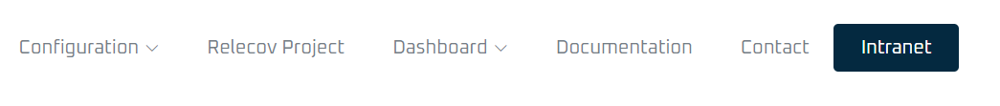
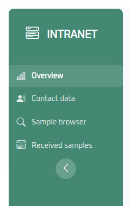

# Intranet Overview

The Intranet is an area where laboratory staff can view information about the samples they have previously uploaded.

It is important to note that each laboratory can only access information related to their own samples.

For this reason, you must log in to access this area.

## Accessing the Intranet

To access the Intranet, click on the **Intranet** button.

---

If you do not have login credentials yet, contact your manager to request them.

For **admin** users, follow the instructions provided in [Create new user](../create_new_user.md) to add a new user.

---

Enter your username and password, then click the **Submit credentials** button.

After a successful login, you will have access to the Intranet features, and the available options will be displayed on the left side.

You can also confirm that you are logged in by checking the top right corner, where your username and a **Close session** button will be visible.

Once logged in, there are two possible user roles:

1. User with the **Relecov Manager** role  
2. User belonging to a laboratory

The main difference between these roles is that a Relecov Manager can search and view samples from any laboratory, whereas a regular user can only search and view samples belonging to their own laboratory.

When navigating through different options in the top menu, the Intranet menu will be replaced by the menu relevant to the selected option. However, you can return to the Intranet at any time by clicking the **Intranet** button.

## Inside the Relecov-platform Intranet

The application will display the Intranet home page.  
On the left, you will see a side panel with the available utilities.

## Logout

Before exiting the application, it is recommended that you log out of your session.

Click the **Close session** button located at the top right corner.