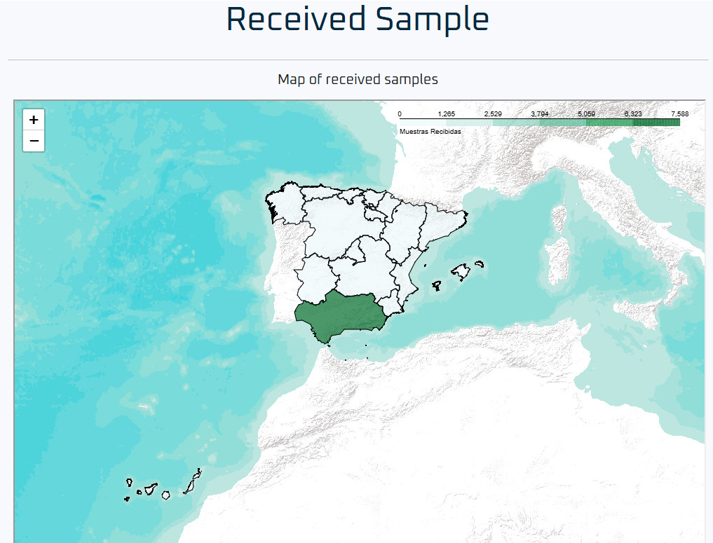
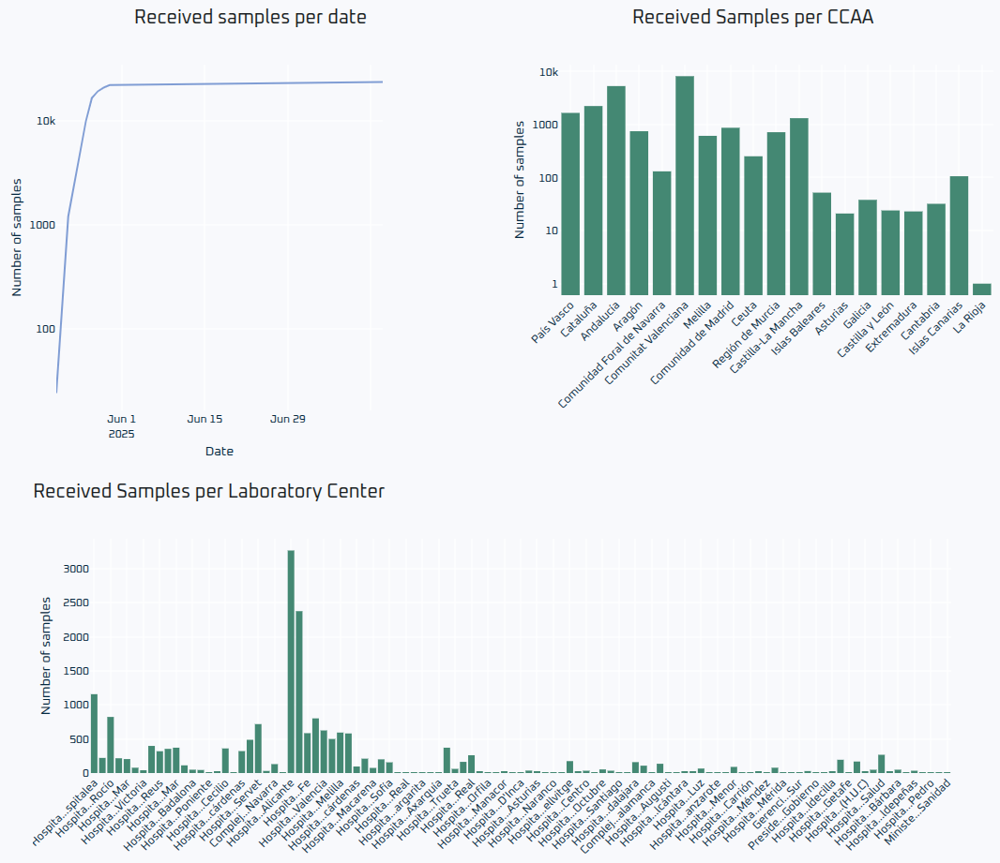

# Received Samples

These graphics provide an overview of the samples received on the Relecov platform.

The first image displays a map showing the number of samples received.  
You can use your mouse wheel to zoom in and out of the map.

The following charts show the number of samples received per date,  
as well as the number of samples received by each Autonomous Community and each Laboratory Center.

 
