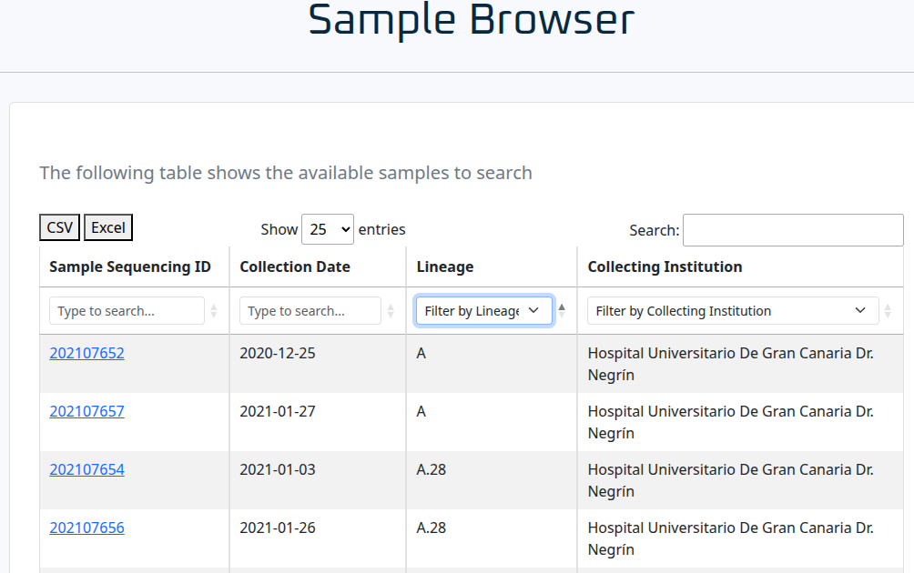
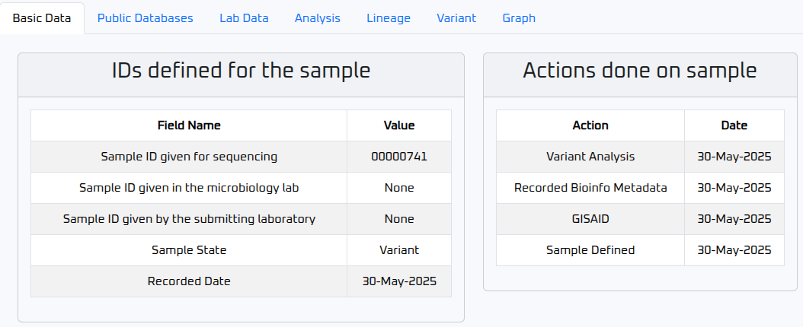
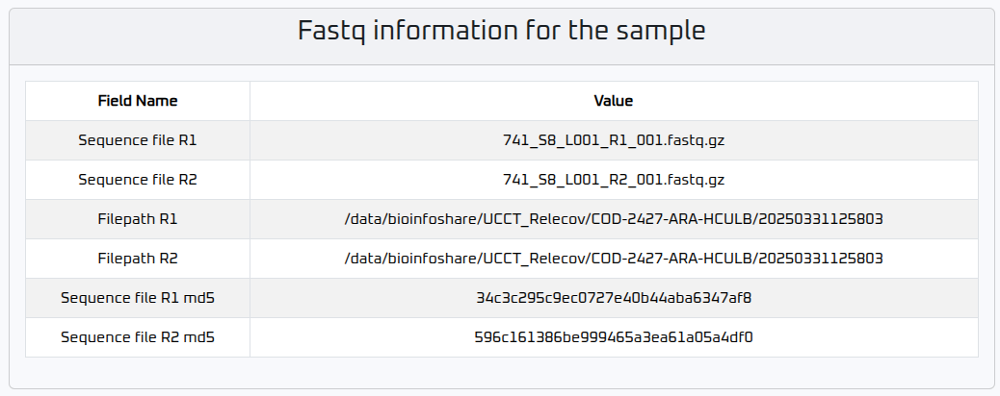
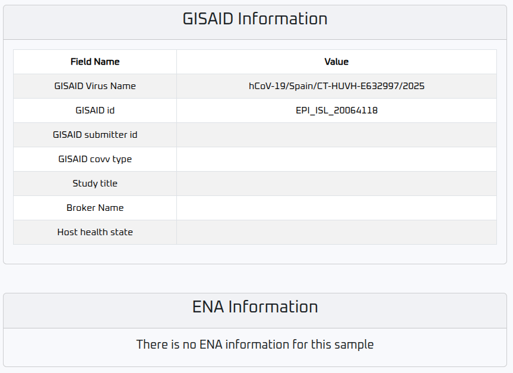
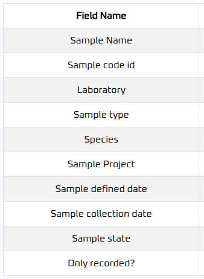
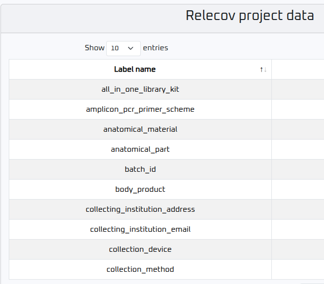
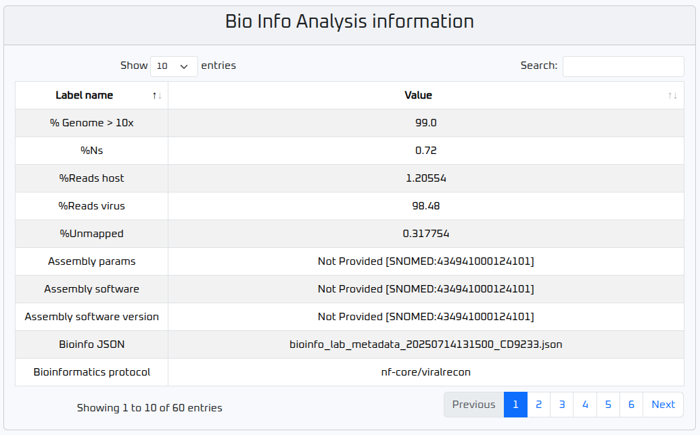
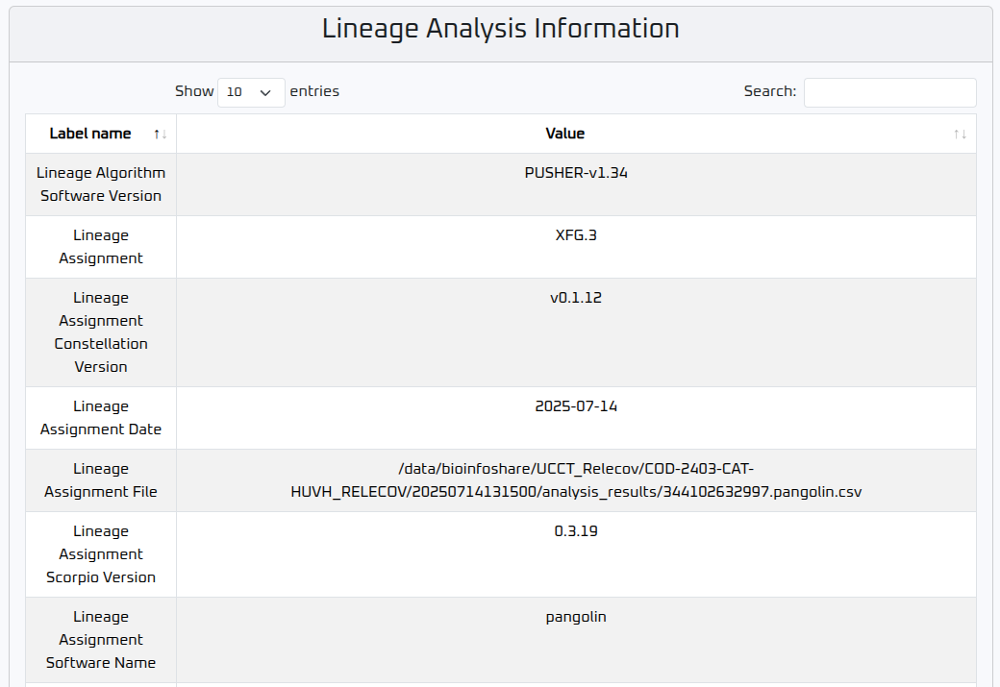
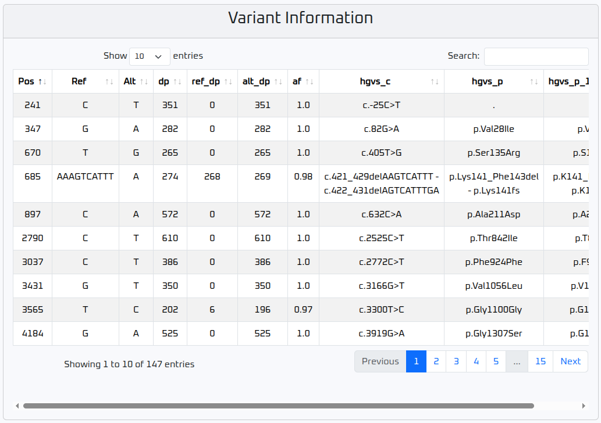
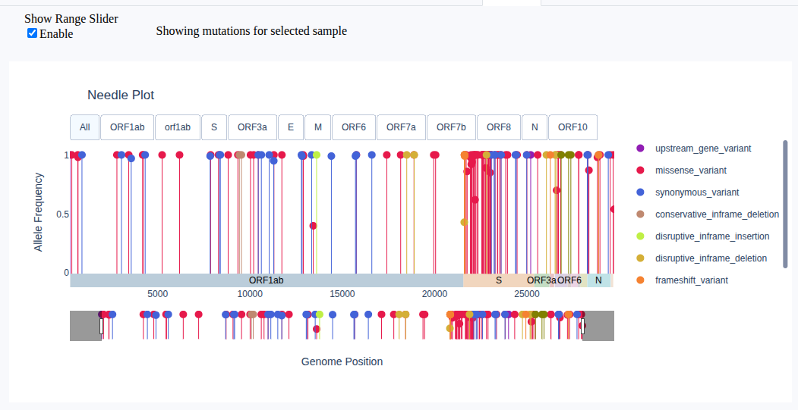

# Sample Search

To retrieve information about the samples stored in RELECOV, a search form has been provided.

The **Sample Browser** option is available in the Intranet area by selecting **Samples browser** from the left-side menu.

There are two different views depending on the role of the user currently logged in, but in both cases a table indicating the available samples to search is displayed. The following is an example of what would be shown:

If the user has the **Relecov Manager** role, all uploaded samples will be shown, and the user will be able to select any of them and check the information related to it.

For users with **other roles**, a similar page is shown, but only those samples related to their own laboratory will appear. These users cannot view or search for samples from other laboratories.

As you can see, it is possible to either look for specific samples based on their sequencing ID or based on the collection date. It is also feasible to filter samples by lineage or by the collecting institution. You can also use the search box at the top right corner to directly look for those samples that meet what is being entered in such box. 

The resulting table can be downloaded in .csv or .xlsx formats as well. 

## Displaying Sample Search Results

Once you've found a sample that you're interested in, click on the sample link to view its detailed information.

At the top, you’ll see several tabs with categorized information.

The number of tabs depends on the available data for the selected sample.  
If a tab is not visible, that means there is no data for that section.

The **Basic Data** tab opens by default. It includes:
- The various names assigned to the sample (e.g., laboratory name, microbiology ID, sequencing name).
- A history of actions performed on the sample, such as:
  - When it was stored in Relecov
  - Uploaded to GISAID
  - Metadata entry for bioinformatics
  - Variant analysis completion

A table at the bottom displays information related to the FASTQ file:

### Public Databases Tab

This tab contains information about the sample’s status in public databases such as GISAID and ENA.

In the following example, the sample has been uploaded to GISAID, but no information has yet been retrieved from ENA.

### Lab Data Tab

This section contains information provided in the lab metadata.

It is divided into two tables:
- **Metadata Lab Information**: includes the date the sample was recorded and collected.

  

- **Relecov project data**: includes additional metadata from the lab file.

  

You can browse additional pages using the **Next** button or search for specific parameters using the **Search** field.

### Analysis Tab

This tab shows data collected during bioinformatic analysis.  
You can browse or search within the table.

### Lineage Tab

Displays the lineage information of the sample.

### Variant Tab

Shows variant positions detected in the sample.

### Graph Tab

Displays graphical representations of the sample’s data.

