# Methodology Dashboard

The Methodology Dashboard displays statistical information gathered from laboratory metadata and the bioinformatic analysis process.

When you open the dashboard, several visualizations will be presented.

The **first row of graphics** provides insights into how laboratory and bioinformatics metadata fields are being completed:

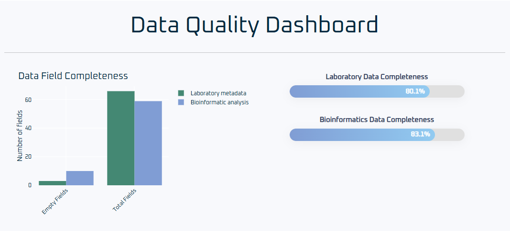

- The **first graph on the left** shows the number of fields that are **never filled** across all samples.  
  This can help identify fields that may be unnecessary in your lab’s or bioinformatics metadata.  
  However, keep in mind that some fields are required only in specific cases, so this should be interpreted with caution.

- The **second and third graphs** in this row show the **average percentage of filled values** for each field across all samples.

---

**Example to clarify the graphs:**

Imagine you have 4 samples, each with 5 fields.  
If 1 of these fields is never filled in any sample, the **first graph** will show 1 always-empty field out of 5 total fields.

For the remaining 4 fields:
- Fields 1, 2, and 4 are filled in 100% of the samples
- Field 3 is filled in 60% of the samples

The percentage displayed in the graph will be the average of these:  
`(100% + 100% + 60% + 100%) / 4 = 90%`

---

The **second row of graphics** shows how many samples contain a value for each field.

- **Blue bars** represent fields from **laboratory metadata**
- **Green bars** represent fields from **bioinformatics metadata**

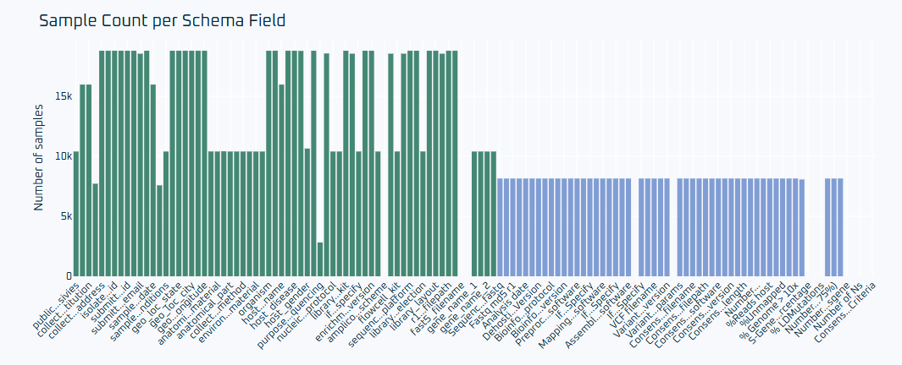

Below the charts, a table displays the same information in numeric format:

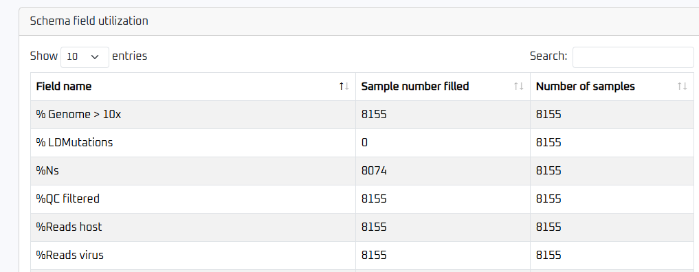

---

## Host Demographics

This dashboard provides information about the host from which samples were collected.

- The **first row** shows a bar chart of **host age distribution** and a pie chart representing the **gender breakdown**:

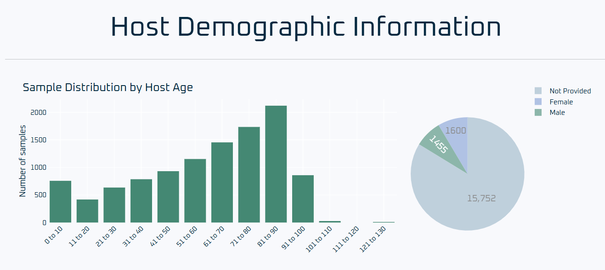

- The **second row** breaks down host age distribution further by gender:

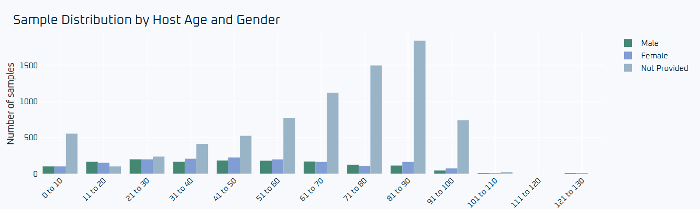

---

## Sequencing Overview

The **Sequencing Dashboard** displays data related to the sequencing process.

- The first chart shows the **sequencing instruments** and **library preparation types** used:

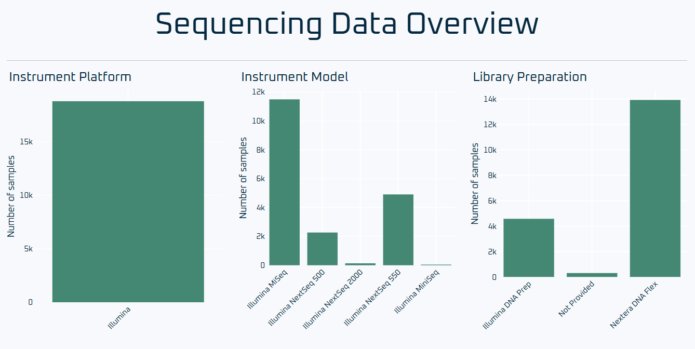

- Additional charts show:
  - **Read length distribution**
  - **CT values by library preparation kit**
  - **CT values per base pairs**

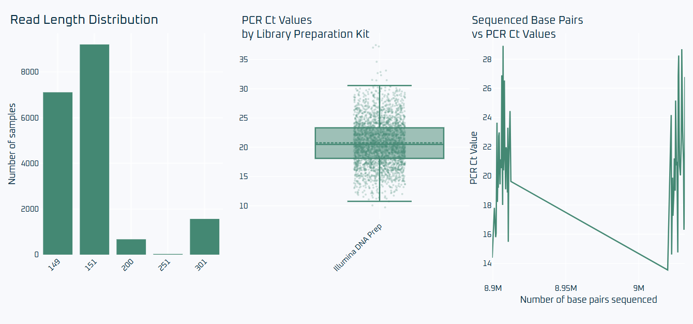

---

## Sample Processing

This dashboard shows details about the **extraction protocols** used during library preparation.

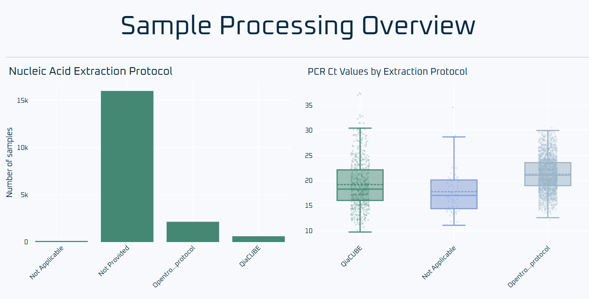

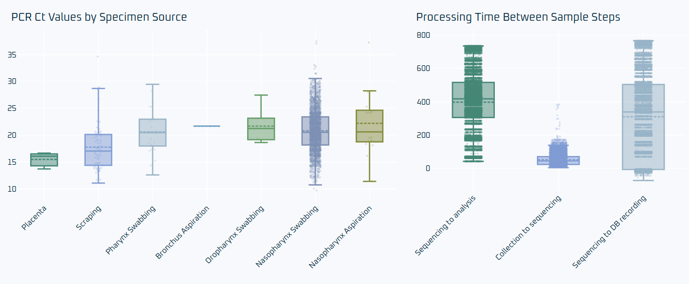

---

## Sequencing Quality and Depth Analysis

This section of the dashboard displays statistics gathered from the bioinformatic analysis process.

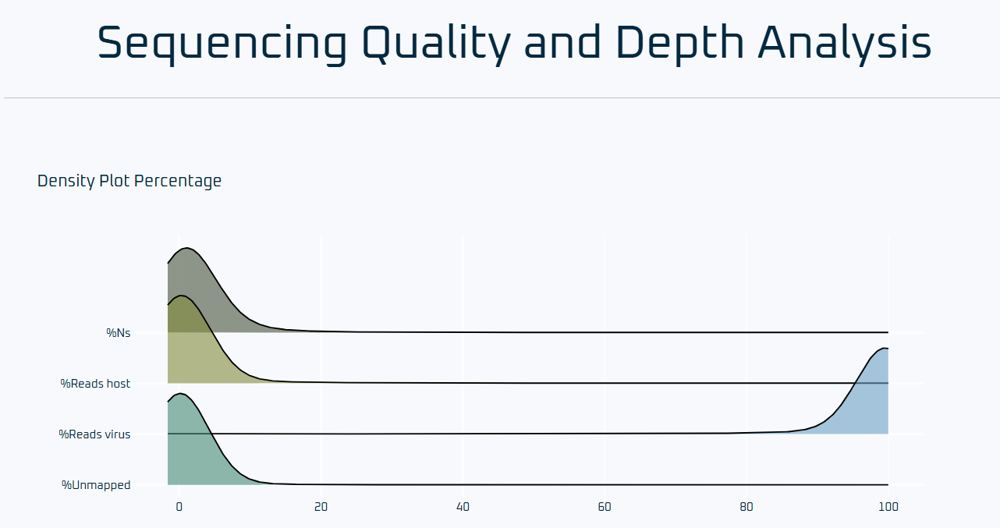

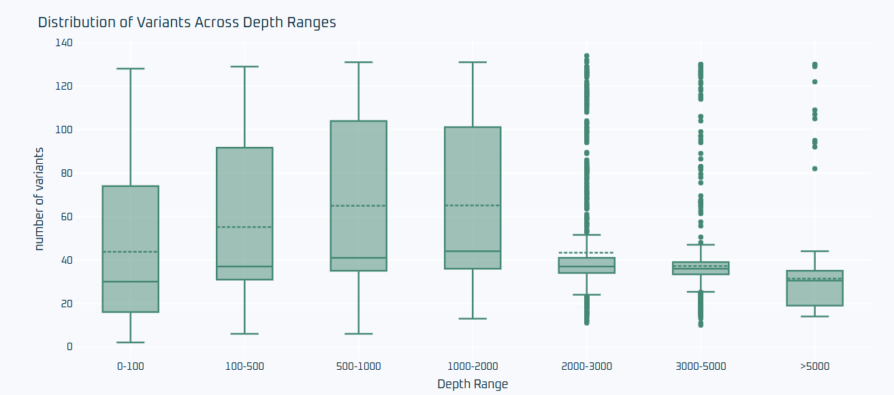

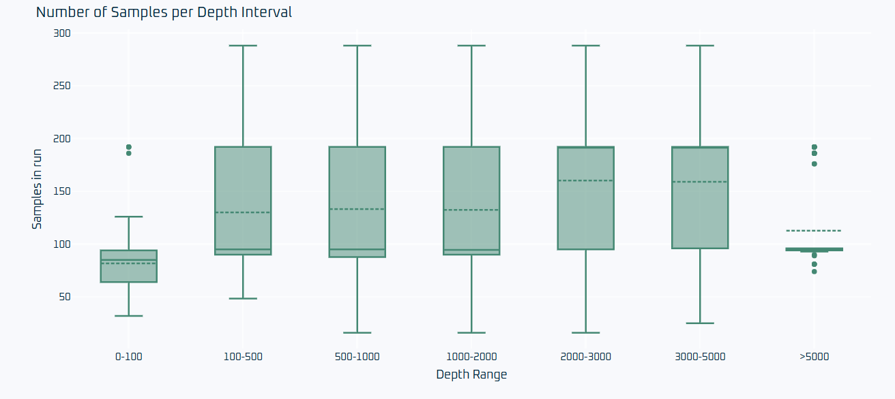