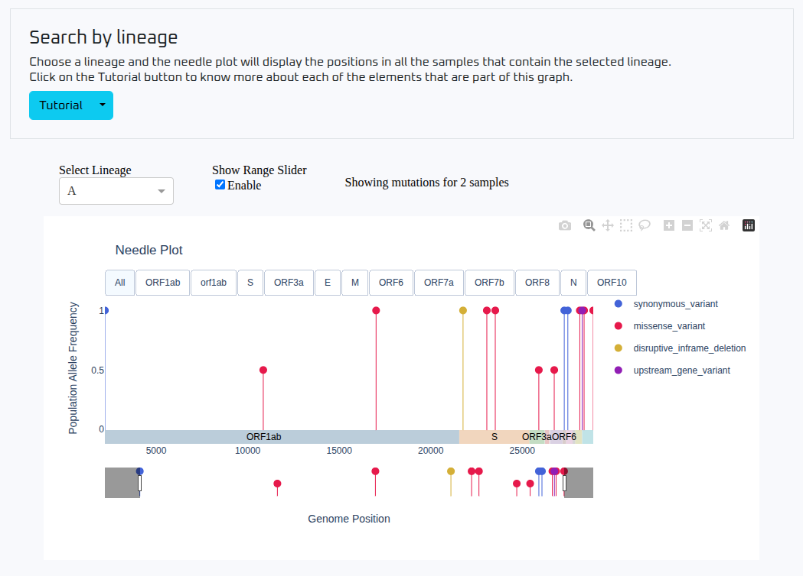
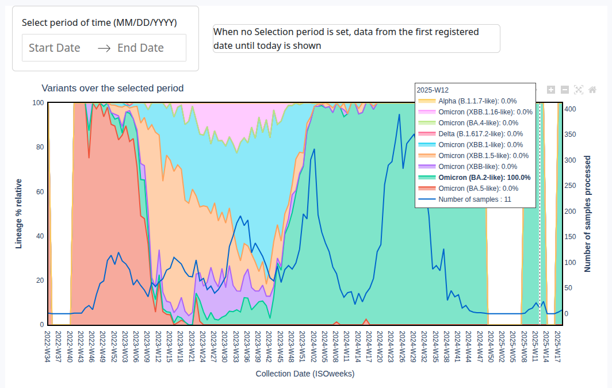

# Variants Dashboard

The **Variants Dashboard** provides a collection of interactive visualizations related to the results of detected variants in the samples, as identified through bioinformatics analyses.

## Mutations in Lineages

This interactive **needle plot** displays the mutations found in samples for each lineage registered in the database.

- The **height** of each needle represents the **population allele frequency**.
- The **color** indicates the **type of mutation**.
- The **x-axis** represents the length of the SARS-CoV-2 genome, with each needle placed at the corresponding genomic location of the mutation.

You can select any lineage from the database and **zoom** into specific regions of the genome for closer inspection.

A tutorial is available at the top of the dashboard to help you understand each element of the graph.

## Lineages VOC

The **Lineages VOC** (Variants of Concern) graph shows how variants have evolved over time in the database.

- Due to the large number of lineages, the graph summarizes them into **variants**, which are a higher-level classification.
- **Multiple lineages** may be grouped under the same variant.
- **Each color** represents a different variant.
- The **area** occupied by a variant reflects its **relative abundance** over time.
- The **default date range** corresponds to the earliest and latest sample collection dates found in the database.

