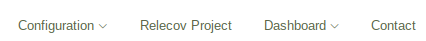

# Configuration

After running the installation script and settings, Relecov server is up, so
anyone that access the relecov url can see about it. However at this very moment
there is nor information neither options to start uploading data.

Admin user must perform more steps to create a the basic environment for users
can use the application.

Login as **"admin"** user to see the configuration Menu.

Note. That this menu is only available when login with user name as admin.

When click on the configuration tab, you can see that serveral options that we
are going to describe below.

## Table of Contents

1. [Schema](#schema)
2. [Metadata](#metadata)
3. [Annotation](#annotation)
4. [User creation](#user-creation)

## Schema
The first step is to load the relecov schema into database.

For your convenience we have kept the latest schema for relecov in conf folder. Of course you can upload your own schema, but be aware that it could run into issues, because as we design "relecov platform" to be flexible, we have not tested any single scenario.

In the form select the **relecov schema file** and click on the **Default schema** button to define that this schema will be used as default settings.

Keep in mind that it is allowed to define as many schemas as you wish but only one must be the default one from where information must be filled.

Please be patient, as the upload process takes some time.

### Show schemas
Once the schema is loaded you can see the schemas defined in your system when clicking on "Show Schemas " tab.

Any schema is available for download, in json format, by click on the download button.

If you want to see more detail information about any schema, click on the desired schema name to get a table with all properties defined for this schema.

Use the search field, to look for a specific string or you can sort any column selecting the small arrows in each column.

If you wish you can download the table in excel or in csv format using the buttons located at the bottom of the table.

After you have define the schema go to next chapter **Metadata**.

## Metadata

Next steps is to define the Metadata fields, select from the top menu

Configuration --> Metadata Visualization.

You will get a form to define the fields that will show later on when uploading samples metadata.

You can see that there is already fill with information.

This settings are collected from 2 different sources:

* relecov schema loaded in the previous chapter. When all fields that has the fill mode property to "sample" are showed.
* template_for_metadata_form.txt, which is located in conf folder. From this file the "Position in the form" is collected and presented in the table.

We have created this division, in order to reduce the time when user is typing information to upload Metadata information. Then for those fields that are
related to all samples, only once is typing.

The fields that we have considered that apllies for all samples in Metadata we
named them as "batch" and for those that each sample has a different value we have
named as "sample".

This is the reason that in the Select columns each field can be selected as:

* sample
* batch

We recommend to keep the settings as they are, but of course you can change the order of visualization, if a field is showed, or it the field apply to all samples or it must be set for each one.

Apply the selected fields by clicking on the submit button. As result you will get the confirmation window.

At this point you have defined the fields that are required to upload your sample metadata to the platform.

**Note that only one metadata form allowed to be defined.**

For that reason the next time that you select in the menu

Configuration --> Metadata Visualization

You not longer see the previous form for selecting the fields but a new window where you can see the selected fields.

By default the "Fields for sample" tab is open. From here you can see the metadata fields that have to be filled each time for each sample.

To select the fields that you have to write once for all sample, click on the "Fields for batch" tab.

As before you can sort the information by clicking on the small arrows in the column names.

As mention, only one metadata form can be defined in the system, so in case you need to set different fields, you need first to delete the existing one.

For doing it, click on the Delete Fields tab.

As you see there is a Warning message indicating that this action cannot be reverted. Once it is deleted it cannot be recover.

To define new fields, repeat the definition process again.

## Annotation

The last step for configuration is to upload a file which contains the virus
annotation.

This file must be in a **gff** format, that you can upload your own or use the
virus annotation that is stored in the "conf" folder named "NC_045512.2.gff".

For uploading the file, select **Virues Annotation** from the Configuation menu.

Select the file and submit your request.

To see the already loaded files click on the Show Annotations tab.

If you want to known the gene annotation for a specific organism click on the
organism name to open a new window which has these information.

## User creation

This step does not belong to relecov application configuration but the normal
maintenace of user creation to provide them to access the application.

There are 2 types of users:

1. Users that can see information from other laboratory.
2. Users that only can see and upload metadata information.

For the first ones, they belongs to so colled **RelecovManager** group. They
are the users which have more priveleges, from they can see sample information
for any laboratory.

Normal users, they belongs to a laboratory, and they has the role to upload
metadata information. They can see information about samples, but searching and
displaying is limited to the samples that the laboratory that user belongs to.

As the process of user creation is part of the maintenance activity we have
create a separate chapter inside FAQ. To check the documentation for user creation
click on  a new user now [How to create new user](createNewUserAccount.md)
