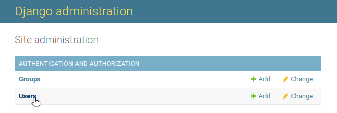
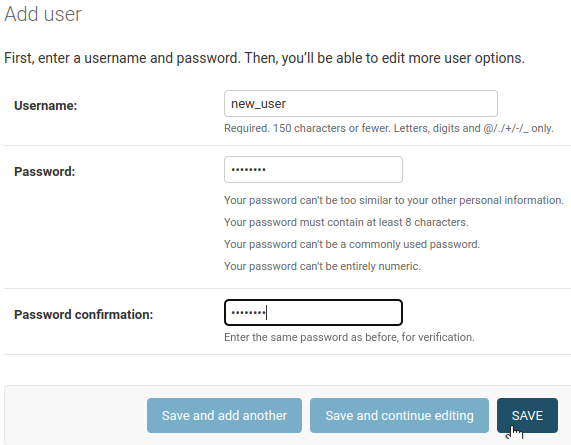

# How to create an user account

Only admin user is allow to create a new user account. 

If you are regular user, contact with your managers to request an account

The following steps can only be executed by admin login user.


In your navigator add "/admin" to the main url of your relecov application to access the administration environment.

For example: 
```
http://relecov.org/admin

```

Under the "Site administration" area on Users row click on "+ Add" link.


In the left panel we will click on Users




In the central part of the screen, a table will be displayed showing us all the users registered in the application,
at the moment only the administrator, recently created in the previous step.
To add a new user we will click on the ADD USER button.


Fill username and password fields correctly and click on SAVE button.



After clicking on the SAVE button, we will see another form where we can enter more detailed information about the user, in addition to managing the permissions that the user will have.

**Personal info:**
   -  First name
   -  Last name
   -  Email address
**Permissions:**
  - Active:  *Designates whether this user should be treated as active*
  - Staff status: *Designates whether the user can log into this admin site*
  - Superuser status: *Designates that this user has all permissions without explicitly assigning them.*
  - Add to groups
  - User permissions
