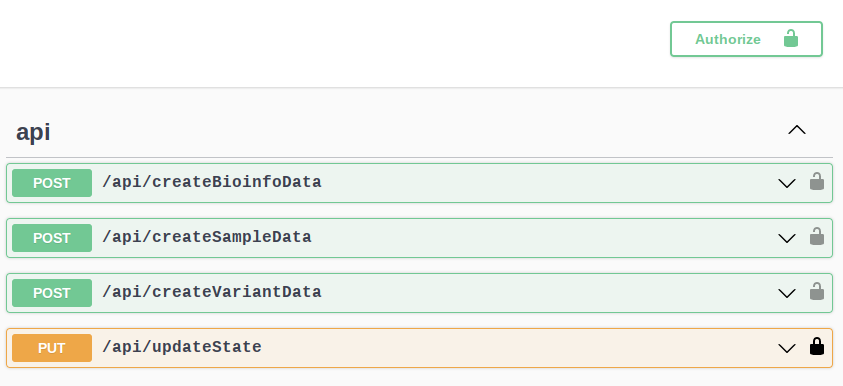

# How to use plataform API

There are 3 ways thah can be used to send a request using Relecov API.

- Graphic interface using swagger.
- update-db module inside Relecov-tools.
- Terminal console using "curl" or similar.

For any of these methods user must send Authentication credentials to upload
information to Relecov Platform.

## Graphic interface using swagger

Swagger application is already integrate with Relecov Platform and is 
 available typing in Navigator the url :

http://your_relecov_server/swagger


In the swagger page you can see on the rigth top a button for authentication.
(Authorize)



Click on authorize button to add your user access credentials. Type your user 
and password. and click on **Authorize** button.

At this very moment this data are saved in you local browser to be ready at 
 the time that you want to send a request. It means that so far no credential
validation is done over relecov platform server.

--- 

Note.- apiKey is not implemented yet. This authentification method is planned 
to be available later on.

---


### Create Sample

First POST request that you have to run is the **createSampleData**. Click on
the arrow down to visualize the additional information for this request.

There are 2 main parts:

- Request body
- Responses.

Inside the "Request body" you can see an example, in json format, where for 
each line the text berore ":" is the field name and on the right side is the
value.

After the example box, the "Responses" area shows the possible returns of the 
query.


To send the CreateSample request using this graphical environment, click on the
"Try it out" button.

Then the box example has changed to white background and it is allowed now to 
write in this box. 

Change the example values to the ones that apply in your case and click on the
"Execute" blue button.

If all values are valid you will get a successful response.

### Create Bioinfo data

After the sample is defined in database you can add more information to the
 sample using the "createBioinfoData" request.

Same structure is showed when click on the "arrow down". Now you will see the 
example for sending the request, and the possible responses.

Follow the same procedure as before and after clicking on the "Try it out", 
modify example values and click on "Execute button".


### Create Variant data

To add variant information for a sample you have to use "createVariantData". This
request is a little bite different as the previous ones, because the "variants" field is al list of dictionary.

In the example is showed only 2 variants for the sample. Repeat this part as many
variant that were found in your sample.


### Update Sample state

This last request is used to add a state to  the sample. State is the action done
on a sample. For example if you want to indicate that sample is upload to ENA, 
you can use this PUT request by setting on the state to "Ena".


## Using Relecov-tools

The python package for Relecov tools were designed to facilitate the flow proccess
from collecting metadata information from the Laboratories/Hospitals to relecov
platform. 


To upload information to Relecov platform you must use the "update-db" option 
when executing the relecov-tools command. 

For more information for using relecov-tools have a look at github 
[relecov-tools](https://github.com/BU-ISCIII/relecov-tools)

## Terminal curl or similar.

Open a console and write first the heading where is defined the url and content
type application, and then include in the request body the fields and values 
that are applicable for each request.


### Example for sending the request using curl command
Below shows the examples you can use to send the request to Relecov platform.

#### Example for Create sample

```
curl -X 'POST' \
  'http://<your relecov url server>/api/createSampleData' \
  -H 'accept: */*' \
  -H 'Content-Type: application/json' \
  -H 'X-CSRFTOKEN: H5Mt8YOYlg0uxjv3LlhTSFtVbjOwvKydHCGydww5soT5dAezQN9e5F3uKkIjHUko' \
  -d '{

   }'

```
Inside the "-d" block include the sample data. Use as template the example that
was showed before when explaining in the swagger chapter.

#### Example for Bioinfo data.

```
curl -X 'POST' \
  'http://<your relecov url server>/api/createBioinfoData' \
  -H 'accept: */*' \
  -H 'Content-Type: application/json' \
  -H 'X-CSRFTOKEN: QwHvCeQvU9DPTCT679DkG6dBrTtDP1RuQ3BAHMyC1hwqzTCCcBvFT6Na0Unq1bDF' \
  -d '{
    
   }'

```


#### Example for Variant sample data.

Use this information to build your request. Fill in "variants" field the same
structure as described above.

```
curl -X 'POST' \
  'http://<your relecov url server>/api/createVariantData' \
  -H 'accept: */*' \
  -H 'Content-Type: application/json' \
  -H 'X-CSRFTOKEN: QwHvCeQvU9DPTCT679DkG6dBrTtDP1RuQ3BAHMyC1hwqzTCCcBvFT6Na0Unq1bDF' \
  -d '{
  "sample_name": "your sample",
  "variants": [

   ],
   }'
   
``` 

#### Example for Update state sample
Using this example replace the sample_name and state with your settings.

```
curl -X 'PUT' \
  'http://<your relecov url server>/api/updateState' \
  -H 'accept: */*' \
  -H 'Content-Type: application/json' \
  -H 'X-CSRFTOKEN: QwHvCeQvU9DPTCT679DkG6dBrTtDP1RuQ3BAHMyC1hwqzTCCcBvFT6Na0Unq1bDF' \
  -d '{
  "sample_name": "your sample",
  "state": "state value"
}'
```
