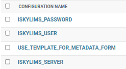

# Installation Steps

## Load setting values on database

## Settings
There are some settings that could be change on different instances of the platform,
like for example, where develop the code or in production or for those values
that can not be in a flat file because it contain sensible information, they will
store on database and only the admin user will have access to view/modify.

To upload these parameters into Relecov Platform open a console terminal and inside
virtual environment execute:

```
python manage.py loaddata conf/upload_tables.json
```


### iSkyLIMS settings
To define the iSkyLIMS settings go to django admin page using the admin user to login.

Navigate on the left side and click on the **Config Settings** table.

Then on the right side you will see the parameter list that you can modify and
change according to your configuration.

The following figure is displayed.



As you can see there are 3 parameters related with iSkyLIMS:
- ISKYLIMS_SERVER.
- ISKYLIMS_USER.
- ISKYLIMS_PASSWORD

**ISKYLIMS_SERVER**. Contains the url where the iSkyLIMS is located. For example: www.iskylims.org

**ISKYLIMS_USER** and **ISKYLIMS_PASSWORD**. Contains the login credentials (userid and
password) that are defined on iSkyLIMS to send the REST API request that
requires authentication.
