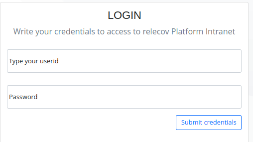

# relecov-platform Intranet

### How to access to relecov-platform Intranet

Requirements:

- User account provided by the application administrator. For more info, [click here](/documentation/createUserAccount).

On the home page of the relecov-platform application, we must click on the Intranet link, as shown in the following image:

Now we can see a panel to access the intranet.
We must enter our username and password, and finally click on Submit credentials button.

After entering our credentials correctly, the application will take us back to the home page.
In the upper right corner we will see our username and the logout button

To access the utilities contained in the intranet, we will click on the Intranet button again.

### Inside relecov-platform Intranet

The application will show us the home page of the intranet.
On the left we will see a side panel with the available utilities

Available utilities

**Form Metadata Labs**
    - Submit Data
    - This process has been divided into two steps.
      1. In the first step show us a form where we introduce the common fields to all the samples. This form will be validate.
      2. In the second step we will enter the rest of the metadata in a table with excel format.
    - Contributor Info
      - Laboratory Information
        - Hospital Name
      - Contact Information
        - Email
        - Telephone Number
        - Position in the hospital
