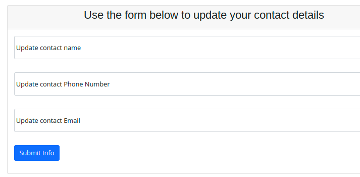

# Laboratory Contact Data

When login to Relecov your user id is associate to a laboratory. 

---
This link was done when admin create the user account.

---

You can check the contact information by selecting **Contact data** on the left menu.

Then contact name, telephone and email is showed.

If this information is not updated you can modify the information filling the
right one in the form that is bellow.

Then submit the information and confirmation page is showed.