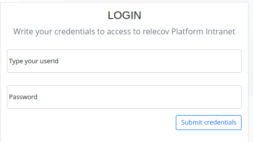
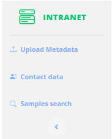

# Intranet

Intranet is an Area where Laboratory staff can see information about the samples
that they have preeviously uploaded.

It is important to mention that Laboratory can only get information from their
own samples.

For that reason you must login to access this area.

## Accessing to Intranet
To access Intranet click on the "Intranet" button.

---

If you do not have login credential yet, contact with your manager to request
them for you.

For **admin** user follow the instructions provide in [Create new user](/documentation/createNewUSer) to add new user.

---

Enter username and password, and click on Submit credentials button.

After login correctly, you have access to intranet functionality and the available options are showed on the left side.

You can also check that your are login by checking on the top right side that 
shows your user name and a button to close session is visible.

Now that your are logged there are 2 possible:

1. User has Relecov Manager role
2. User belongs to a laboratory.

The main difference between both of them is that Relecov Manager can search/visualize 
samples for any laboratory, and normal user can only search/visualize samples
that belongs to their laboratory.

When moving to different options in the top menu, intranet menu is replace by the
one that is applicable for the relevant options for this menu. But you can return 
again to Intranet are by clicking at any time the Intranet button.

## Inside relecov-platform Intranet

The application will show us the home page of the intranet.
On the left we will see a side panel with the available utilities

## Logout
Before exiting the application is recommended that you logout your session.

Click on the "Close session" button located at the top right side.

