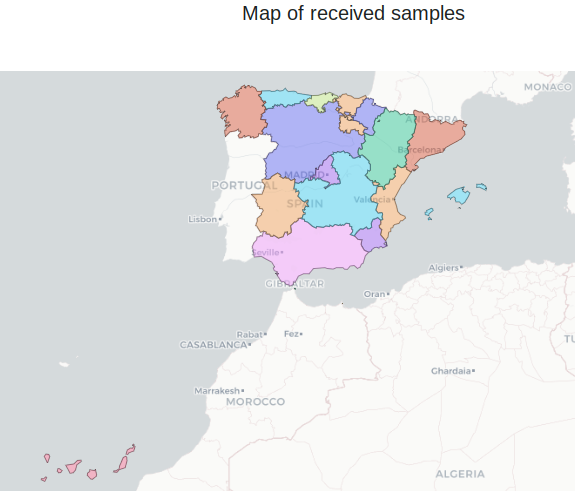

# Received Samples

This graophics will give you an overview about the samples that were received
at relecov platform.

The first picture show in a graphic map the number of samples that were received.
Use the mouse whell to zoom in/out the graphic.

In the following graphics you can see the number of samples received per date and 
also how many samples were received for each laboratory.
 
