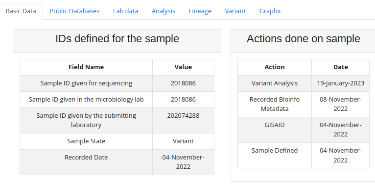
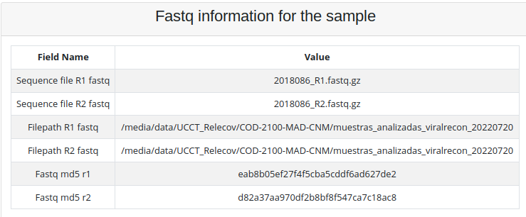
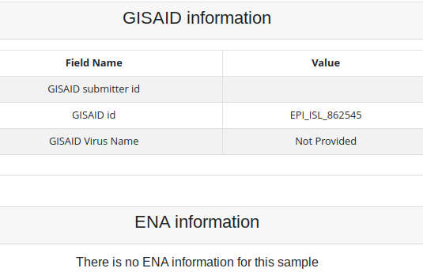
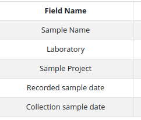
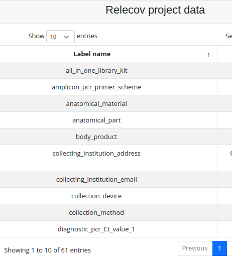
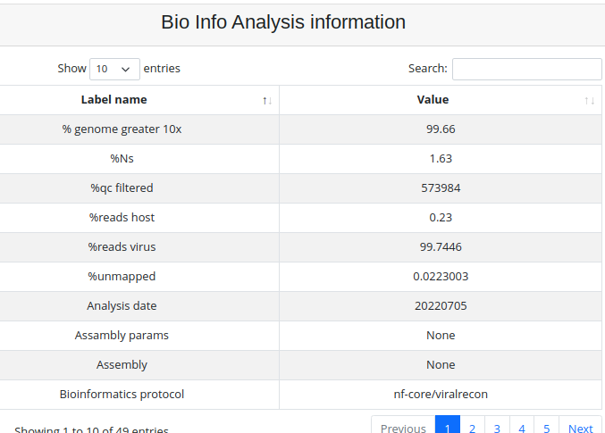
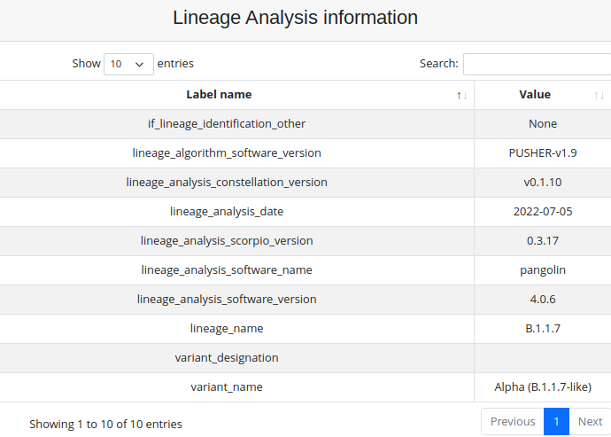
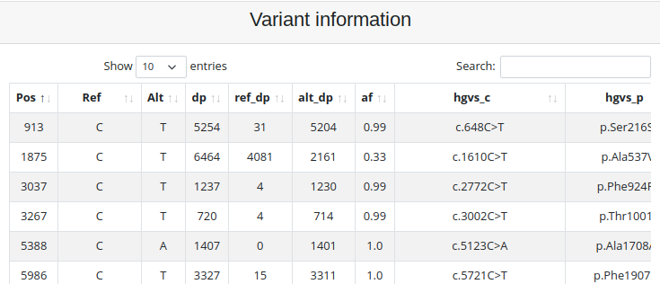
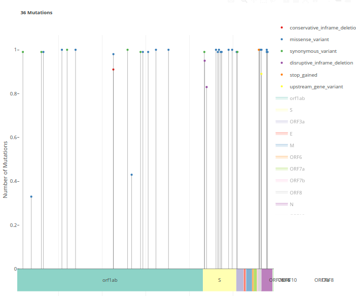

# Sample search

To get information from the samples that are stored in Relecov we have created
a form, from where you can search for the sample that you are looking for.

Sample search option is available on intranet area when selecting **Samples search** 
form the left side menu.

There are 2 different views according to the role of the user you are loged on.

If the role is **Relecov Manager** the following page is displayed.

Where you can filter by:
- State of the sample. Every time that there is an action on a sample a new state 
is added to the sample. For example if sample is processing using bioinformatic
analysis, the analysis state is added. 
- Search by name. Use this option if you one to limit the search only to this sample.
- Defined Date. It is the date that sample was stored in Relecov.
- Search from laboratory. The manager role allows you to search information about
the sample that was upload for any laboratory and also restrict the searching for
a one specific laboratory.

**Other role** we have a similar page, but the difference is that searching is 
restricted to the samples that this laboratory upload previously. In other words
this role does not allow you to see/search other samples data than your own.

As you can see on the heading shows that searching are for your laboratory.

When filling in the form, this works as and **AND** condition. It means that if
you select an state and select a date, the result you will get is the samples 
that match both conditions.

## Displaying your samples match

There are 2 output when you submit your searching query:
- Many samples match
- Only one sample fullfil the imput parameters.

### Displaying Many samples

When many samples match with your query, you will get a table which contains a list 
of samples. This table is paginated so click on the "Next" button, see more samples
or using the "Search" field to reduce the number of samples.

When you found the rigth one click on the sample link to get the collected information.   

### Display one sample

When sample information is displayed, (no matter if you reach it, because there was
only 1 match or because you click  a sample from the sample list), on the top you 
can see that there are some tabs, that you can select to see the information related
to.

The number of visible tabs is accordig to the information existing for this sample.
If you do not see any of these tabs is because there is no information for it.

The default open tab is **Basic Data**. Where you can see information about the 
different names that this sample was given by the laboratory, in the microbiology 
lab and when sequencing.

The actions that were done for this sample. In this example, you can see that 
the dates when sample was stored in relecov, when it was upload to GISAID,
when recording Bioinfo metadata and when the variant analysis was done.

In the table below the information related to Fastq file is showed.

**Public Database** tab.

Inside there is informacion related to GISAID and ENA databases.

As you can see from this example, there is information that this sample was 
upload to GISAID, but so far there is no information collected from the upload 
to ENA.

**Lab data** tab.

Lab data contains information that was given in the Metadata Lab. 

This information is divided in 2 tables.
- Metada LAB information.

With data like date when sample was recorded and collected.

- Relecov project data.

Will have the rest of the information that was collected in Metadata Lab file.

Move to another page clicking on the "Next" button, or use the search field to find 
the parameter that you are looking for.

**Analysis** tab.

Display the information that was collecting during Bio informatic analysis. 

As well you can move to next page, or search for a parameter.

**Lineage** tab.

This tab contains the lineage information of the sample

**Variant** tab.
Variant positions 

**Graphic** tab.

