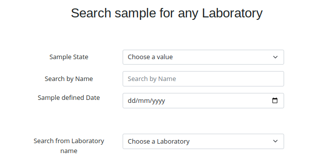
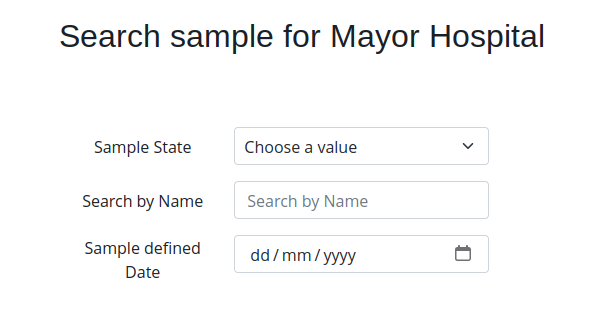
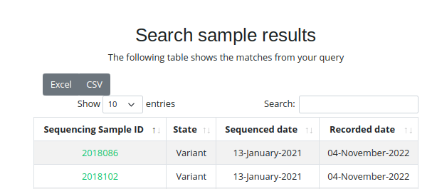

# Sample search

To get information from the samples that are stored in Relecov we have created
a form where you can search for the sample that you are looking for.

Sample search is available on intranet area when selecting **Samples search** 
form the left side menu.

There are 2 different views according to the role of the user you are loged on.

If the role is **Relecov Manager** the following page is displayed.

Where you can filter by:
- State of the sample. Every time that there is an action on a sample a new state 
is added to the sample. For example if sample is processing using bioinformatic
analysis, the analysis state is added. 
- Search by name. Use this option if you one to limit the search only to this sample.
- Defined Date. It is the date that sample was stored in Relecov.
- Search from laboratory. The manager role allows you to search information about
the sample that was upload for any laboratory and also restrict the searching for
a one specific laboratory.

**Other role** we have a similar page, but the difference is that searching are 
restricted to the samples that this laboratory upload previously.

As you can see on the heading shows that searching are for your laboratory.

When filling in the form, this works as and **AND** condition. It means that if
you select an state and select a date, the result you will get is the samples 
that match both conditions.

## Displaying your samples match

There are 2 output when you submit your searching query:
- Many samples match
- Only one sample fullfil the imput parameters.

### Displaying Many samples

### Display one sample
