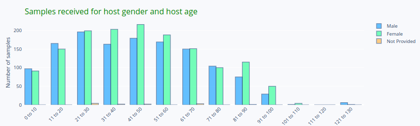

# Methodology dashboard.

Methodology dashboard displays statistic information collected from Metadata 
Lab, and data for all process done in the Bioinformatic analysis.

When you open the Methodology dashboard you will see that some graphics are showed.

The first graphic row displays how the metadata lab and Bioinfo metadata are filled

The first graphic on the left side shows the number of fields that for all samples 
they are never filled with any value.

With this information can help you to identify if there are some fields that could 
be eliminate from Metadata lab or Biofinfo Metada. 
But handle this information keeping in mind that 
there are parameters that are set because in some situation this field is required.

If the first figure shows you the number of always empty fields, the second and the
third graphic on this row shows the mean that each field, from all samples was 
not empty. 

---
To clarify these graphic let me give you an example.  We have 4 samples, which 
have 5 fields each sample. There is 1 field that in all these samples is always not filled.

Then the first graphic shows that empty fields is **1** and total number of 
fields are **5**.

If for the remaining 4 fields:
- Field 1 , 2 and 4 always there is a value for each sample.
- Field 3 not always have a value but only in 60% of samples have one.

The percentage showed in the graphic will be, the mean of (100% , 100%, 60%, 100%) equal to 90%

---

Second row display the number of samples that contains a value for each field.

The blue color are the fields related to Metadata Lab and the green color belongs
to Bioinfo Metadata.

The table at the bottom show the same information as the above graphic but in 
numeric format.

## Host Info

This dashboard shows information related to the host. 

In the first row the bar graphic provide information about how the age of the host
are distributed from the collected samples. The pie chart display the gender percentage 
of these samples.

The second graphic row split the host age information in gender distribution.

## Sequencing

Sequencing dashboard displays information related to sequencing process.

In the first graphic there is information about the different sequencer instrument 
used for sequencing and the types of library preparation used.

The read length used, the CTs per library preparation kit and the CTs per based pairs.

# Sample processing

Sample processing dashboard shows the information related to the different extraction 
protocols used for sample preparation library.

## Bioinfo

