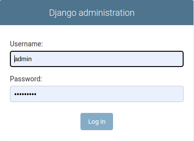

# Nextstrain Installation

Nextstrain application is created as a service in your server. 

There are 2 main steps:
- Install Nextstrain software
- Create the service in your server

Nextstrain software requires that you have sudo privelages, because is going to 
be installed under /opt, and for creating the services must have root access.

---
The instruction provided for installation is assumed that Nextstrain is installed 
on the same server as relecov-platform is installed. 

If you want to install Nextstrain in a different server, the same procedure is valid 
just only copy the service configuration that is in relecov-platform server to
your server.

---

## Install Nextstrain


Create the nextstrain folder to install the application and download the software
from the Nextstrain page.
```
sudo mkdir -p /opt/nextstrain
cd /opt/nextstrain
sudo curl -fsSL --proto '=https' https://nextstrain.org/cli/installer/linux > nexstrain_installer_$(date "+%Y%m%d").sh
```
Set NEXSTRAIN_HOME env variable and run installer
```
export NEXTSTRAIN_HOME=/opt/nextstrain
sudo bash nexstrain_installer_$(date "+%Y%m%d").sh
```

Set conda as default run-time.This will install the nexstrain conda env with all deps using micromamba.
```
sudo /opt/nextstrain/cli-standalone/nextstrain setup --set-default conda
```

Copy auspice dataset to datasets folder. 

This contains all the data that should be rendered by nextstrain app. Create them using the [nexstrain_relecov workflow](https://github.com/BU-ISCIII/nexstrain_relecov)
```
mkdir -p /opt/nextstrain/dataset/sars-cov-2
cp -r /path/to/auspice /opt/nextstrain/dataset/sars-cov-2
```

## Create Nextstrain service

The service configuration file is located in **conf** directory of the relecov-platform.
If you change the installation folder from "/opt" to a different location, replace 
/opt/ for your installation folder.
Copy service file to `/usr/lib/systemd/system`
```
sudo cp /opt/relecov-platform/conf/nextstrain.service /usr/lib/systemd/system
```
By default service is listening on port 8100. If you need to change this port 
edit `/usr/lib/systemd/system` and replace for the port number that you want to use.

### Start Nexstrain service
To get the service up you need to start the service.

```
sudo systemctl start nextstrain

```

Check that no errors occurs.

## Define Nextstrain in relecov-platform

Last step in nextstrain configuration is to define in relecov-platform the 
location and port that your nextstrain application is using.

Open your favorite navigator and type the "localhost/admin" or the "server_domain/admin/ 
to connect with django admin application.



After login, scroll down on the left side and click on **"Config settings"**.

Click on the **NEXTSTRAIN_URL** to change the existing dummy values.

Change the IP/URL and port to the values that your Nextstrain application is using and
click on the SAVE button to store the changes.

## Check Nextstrain 

In your navigator go now to the main page of relecov-platform.

Click on the Nextstrain and check that a new tab is displayed with Nextstrain


