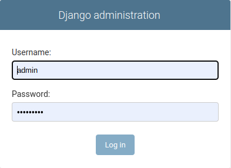

# Relecov Installation

Relecov application uses Django as the main framework to build the application.


The installation procedure assume that the following requirements are fulfilled:

-  Relecov application has to be installed in a linux server. Tested on Ubuntu 22.04, CentOS 7 and Red Hat 8.
-  Python3.8.10 or higher already installed.
-  Mysql server is eihter installed in the server or remote.
-  Database called **"relecov_platform"** is defined.
-  User is configured to access this database with the right permisions to create/delete/modify tables, index.
-  Apache server must be running in the server
-  iSkyLIMS must be installed. Follow the installation guide defined in github [iSkyLIMS](https://github.com/BU-ISCIII/iSkyLIMS#readme).
-  Nextstrain application.

For your convinence a installation script was created to perform the software installation 
and the first configuration.

The installation procedue as well as the script are available at github [Relecov-platform](https://github.com/BU-ISCIII/relecov-platform#readme)

## Settings
There are some settings that could be changed on different instances of the platform.
For example, when you are installing the application in the testing environment
you could have different settings than in production.

We have also defined some settings that could change, like moving some servers
to a different url, they can changed any time without impacting the installation.

For them, they will store on database where only admin user will have access to 
view/modify these settings.

During the installation the script requests to define the credentials used for
admin user.

Open your favorite navigator and type the "localhost/admin" or the "server_domain/admin/ 
to connect with django admin application.



After login, scroll down on the left side and click on **"Config settings"** to see 
the parameters that you could change their value to fix your installation.

**WARNING**

-----

**DO NOT CHANGE** the CONFIGURATION NAME.

By changing them the application will not work properly

-----

As you see that some defaults are set during the installation with dummy values. 

Through the following chapters we provide you some explanation to set the values 
that you need for your installation. 


### iSkyLIMS settings

As mention above, in requirements, an iSkyLIMS instance must be installed.

There are 3 parameters that you must set:

- ISKYLIMS_SERVER.
- ISKYLIMS_USER.
- ISKYLIMS_PASSWORD

**ISKYLIMS_SERVER**. Contains the url where the iSkyLIMS is located. For example: www.iskylims.org

**ISKYLIMS_USER** / **ISKYLIMS_PASSWORD**. Contains the login credentials (userid and
password) that were defined previously on iSkyLIMS.

### Nextstrain

Click on **NEXTSTRAIN_URL** and change the configuration value with url and port of your application

### Samba folder

Define the folder where metadata files are stored when using the metadata form page.

### Your institution

Click on **SUBMITTING_INSTITUTION** and change the dummy value with the name of your institution.


### Remain values.

There are some other parameters that you could change. which are not described above
but we recommend you to keep these values as they are already set.


```
python manage.py loaddata conf/upload_tables.json
```
