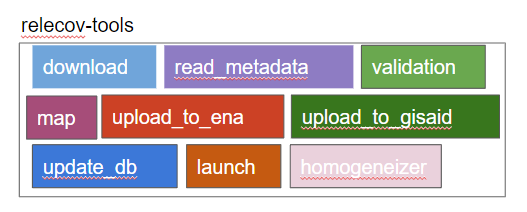

# relecov-tools

## Table of contents

1. [Overview](#overview)
    1. [command-line](#command-line)
    2. [package import](#package-import)
2. [Modules](#modules)
    2. [homogeneizer](#homogeneizer)
    3. [download](#download)
    4. [read-metadata](#read-metadata)
    5. [validate](#validate)
    6. [map](#map)
    7. [upload-to-ena](#upload-to-ena)
    8. [upload-to-gisaid](#upload-to-gisaid)
    9. [update-db](#update-db)
    10. [launch](#launch)


## Overview
[relecov-tools](https://github.com/BU-ISCIII/relecov-tools) is a set of helper tools for the assembly of the different elements in the RELECOV platform (Spanish Network for genomic surveillance of SARS-Cov-2) as data download, processing, validation and upload to public databases, as well as analysis runs and database storage.

relecov-tools is designed as a python package, it can be installed both via conda or pip, and it can be used as a command line tool or importing it in any python program as a normal package.

### Command-line
relecov-tools provides a command-line version with help descriptions and params prompt if needed.

```
$ relecov-tools --help
                          ___   ___       ___  ___  ___
             \    |--|   |   \ |    |    |    |    |   | \      /
             \    \  /   |__ / |__  |    |___ |    |   |  \    /
             /    /  \   |  \  |    |    |    |    |   |   \  /
             /    |--|   |   \ |___ |___ |___ |___ |___|    \/
             RELECOV-tools version 0.0.1
             Usage: relecov-tools [OPTIONS] COMMAND [ARGS]...

             Options:
             --version                  Show the version and exit.
             -v, --verbose              Print verbose output to the console.
             -l, --log-file <filename>  Save a verbose log to a file.
             --help                     Show this message and exit.

             Commands:
                download          Download files located in sftp server.
                read-metadata     Create the json compliant to the relecov schema from...
                validate          Validate json file against schema.
                map               Convert data between phage plus schema to ENA,...
                upload-to-ena     parsed data to create xml files to upload to ena
                upload-to-gisaid  parsed data to create files to upload to gisaid
                launch            launch viralrecon in hpc
                update-db         feed database with metadata jsons
```

### Package import
relecov-tools is designed in a way that you can use import the different modules and use them in your own scripts, for example:

```
import relecov_tools.sftp_handle
user="admin"
passwd="1234"
conf_file="/path/to/conf"

sftp_connection = relecov_tools.sftp_handle.SftpHandle(
    user, password, conf_file
    )
    sftp_connection.download()
```

We'll provide more docs as soon as posible.

## Modules
It consists in a series of modules with different purposes as described below.



#### homogeneizer
The command `metadata-homogeneizer` allows parsing one or multiple files that containing required information to generate the metadata excel file required to upload data to the platform.

In order to use the module you have to prepare two files:

1. First a config file indicating the files, mapping keys and require procesing.

```
{
    ## Python script with processing functions
    "python_file": "ISCIII.py",
    "required_files": {
        # N required files.
        # Each file has several fields: file_name, mapped_fields,
        # and function if any additional processing is needed.
        "metadata_file": {
            # file name
            "file_name": "new_lab_metadata.xlsx",
            # how the columns in the metadata_lab_excel map against YOUR excel.
            "mapped_fields": {
                # column name in metadat excel lab : column name in YOUR excel/file.
                "Public Health sample id (SIVIES)": "Código SiViEs",
                "Sample ID given by originating laboratory": "Ref Hospital",
                "Specimen source": "Muestra",
            },
        # Name of the function in ISCIII.py that is needed for fields processing.
        "function": "None"
        },
    # Example for adding information in other file.
    # Here is a json that has the fastq filenames info that are going to be added to the excel.
    "sample_file": {
        "file_name": "sample_data.json",
        "mapped_fields": {
            "Sequence file R1 fastq": "sequence_file_R1_fastq",
            "Sequence file R2 fastq": "sequence_file_R2_fastq"
        },
        "function": "None",
        # Column used for adding the new two fields.
        "mapped_key": "Sample ID given for sequencing"
        },
    # Example of field fixing based on another file.
    # The names of the originating labs does not match the options
    # available in the metadata lab excel so we have a file to correct that.
    "org_lab_file": {
        "file_name": "laboratory_mapping_list.tsv",
        "mapped_fields": {
            "Originating Laboratory": "mapped_org_lab"
        },
        "mapped_key": "",
        "function": "replace_originating_lab"
        },
    ## Example: just translating a field to english.
    "host_gender_file": {
        "file_name": "",
        "mapped_fields": {
            "Host Gender": ""
        },
        "mapped_key": "",
        "function": "translate_gender_to_english"
        },
    },
    # Finally these are fields that are fixed/same for all samples.
    "fixed_fields": {
        "Submitting Institution": "Instituto de Salud Carlos III",
        "Biological Sample Storage Condition": "-80 C",
        "Purpose of sampling": "Surveillance",
        "Host": "Human",
        "Library Preparation Kit": "Illumina DNA Prep",
        "Enrichment Protocol": "Amplicon",
    }
}
```

2. A python script with your functions for additional processing that should look like this:i

```
def translate_gender_to_english(metadata, f_data, mapped_fields, heading):
    """Translate into english the host gender that is written in spanish"""
    map_dict = {
        "hombre": "Male",
        "mujer": "Female",
        "genero no-binario": "Non-binary Gender",
        "genero no-binario": "Non-binary Gender",
        "desconocido": "Not Provided",
        "unknown": "Not Provided",
    }
    for row in metadata[1:]:
        for key, val in mapped_fields.items():
            m_idx = heading.index(key)
            if row[m_idx] is None or row[m_idx] == "":
                row[m_idx] = "Not Provided"
                continue
                item = row[m_idx].lower()
            if item in map_dict:
                row[m_idx] = map_dict[item]
            else:
                log.error("The '%s' is not a valid data for translation", row[m_idx])
                stderr.print(
                "f[red] The '{row[m_idx]}' is not a valid data for translation"
                )
                sys.exit(1)
    return metadata
```

A complete example of the config file can be found [here](https://github.com/BU-ISCIII/relecov-tools/blob/develop/relecov_tools/schema/institution_schemas/ISCIII.json) and a functioning script file for an instution can be found [here](https://github.com/BU-ISCIII/relecov-tools/blob/develop/relecov_tools/institution_scripts/ISCIII.py)


#### download
The command `download` connects to a transfer protocol (currently sftp) and downloads all files in the different available folders in the passed credentials. In addition, it checks if the files in the current folder match the files in the metadata file and also checks if there are md5sum for each file. Else, it creates one before storing in the final repository.

```
$ relecov-tools download --help
Usage: relecov-tools download [OPTIONS]

  Download files located in sftp server.

    Options:
        -u, --user TEXT       User name for login to sftp server
        -p, --password TEXT   password for the user to login
        -f, --conf_file TEXT  Configuration file in yaml format (no params file)
        --help                Show this message and exit.
```

Configuration can be passed in several formats:
   - if no config_file is passed, default values are fetched from conf/configuration.json, and user and password are asked in prompt.
    - Default values can be overwritten using a yml config file, so you can input user, password, sftp_server, etc.

Config file example with all available options:

```
sftp_server: "sftprelecov.isciii.es"
sftp_port: "22"
sftp_user : "user"
sftp_passwd : "pass"
storage_local_folder: "/tmp/relecov"
tmp_folder_for_metadata: "/tmp/relecov/tmp"
allowed_sample_extensions:
    - .fastq.gz
    - .fasta
```

#### read-metadata
`read-metadata` command reads the excel file with laboratory metadata and processes it adding additional needed fields.

```
$ relecov-tools read-metadata --help
Usage: relecov-tools read-metadata [OPTIONS]

    Create the json compliant to the relecov schema from the Metadata file.

    Options:
        -m, --metadata_file PATH     file containing metadata in xlsx format.
        -s, --sample_list_file PATH  Json with the additional metadata to add to the
        received user metadata.
        -o, --metadata-out PATH      Path to save output  metadata file in json format.
        --help                       Show this message and exit.
```

An example for the metadata excel file can be found [here](./relecov_tools/example_data/METADATA_LAB_TEST.xlsx)

#### validate
`validate` commands validate the data in json format outputted by `read-metadata` command against a json schema, in this case the relecov [schema specification](./relecov_tools/schema/relecov_schema.json).

```
$ relecov-tools validate --help
Usage: relecov-tools validate [OPTIONS]

    Validate json file against schema.

    Options:
        -j, --json_file TEXT    Json file to validate
        -s, --json_schema TEXT  Json schema
        -m, --metadata PATH     Origin file containing metadata
        -o, --out_folder TEXT   Path to save validate json file
        --help                  Show this message and exit.

```

#### map
The command `map` converts a data in json format from relecov data model to ena or gisaid data model using their own schemas acording to their annotated ontology terms.

```
$ relecov-tools map --help
Usage: relecov-tools map [OPTIONS]

Convert data between phage plus schema to ENA, GISAID, or any other schema

    Options:
        -p, --origin_schema TEXT        File with the origin (relecov) schema
        -j, --json_data TEXT            File with the json data to convert
        -d, --destination_schema [ENA|GSAID|other]
        schema to be mapped
        -f, --schema_file TEXT          file with the custom schema
        -o, --output TEXT               File name and path to store the mapped json
        --help                          Show this message and exit.
```

#### upload-to-ena
`upload-to-ena` command uses json data mapped to ena schema to use the [ena_upload_cli](https://github.com/usegalaxy-eu/ena-upload-cli) package to upload raw data and metadata to ENA db.


```
Usage: relecov-tools upload-to-ena [OPTIONS]

Parse metadata to create xml files to upload to ena

    Options:
        -u, --user TEXT                          user name for login to ena
        -p, --password TEXT                      password for the user to login
        -e, --ena_json TEXT                      where the validated json is
        -s, --study TEXT                         study/project name to include in xml files
        -a, --action [add|modify|cancel|release] select one of the available options
        --dev / --production
        -o, --output_path TEXT                   output folder for the xml generated files
        --help                                   Show this message and exit.
```

#### upload-to-gisaid
SOON!

#### update-db


#### Launc

SOON!
