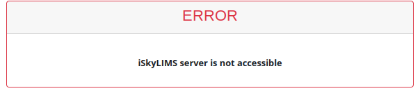
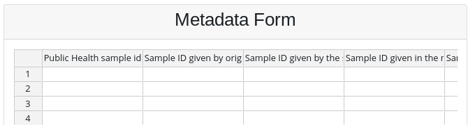
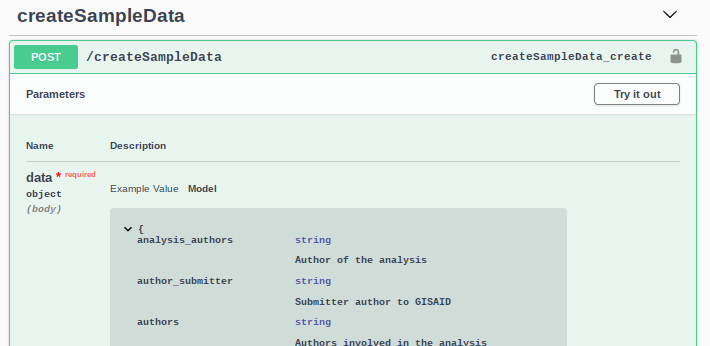

# Upload Metadata Lab

We have provided 3 different ways to upload metadata lab samples.

* Using a Web form
* Upload a batch file
* Using the relecov platform API.

You can use any of them, to upload metadata into relecov platform, but the one to use depends mainly on the kind of information that you have.

If you are collecting the information from the lab and you do not want to mess up with excel files, then the best way is to use the web form. This allow you to upload the samples metadata lab, by guiding you with the information that is required. Also the benefit,  is that not only one person in the lab, but anyone with the login credential, can store data in the system.

In case that you have already prepare your metadata lab in excel using the our template, you can upload it using the batch option.

The third option is using the REST API defined in relecov to upload your data.

## Table of Contents

- [Upload Metadata Lab](#upload-metadata-lab)
  - [Table of Contents](#table-of-contents)
- [Metadata Form](#metadata-form)
- [Metadata Batch](#metadata-batch)
- [REST API](#rest-api)

# Metadata Form

The easiest and the most collaborative way to upload your samples metadata lab is by using the web form that is available once user is logged and selected from the side menu **Metadata Lab --> Submit Data**.

Because some data will be stored in iSkyLIMS, the system makes a check to verify that it is running. If it is not reachable then a error message is presented. Under this scenario it is not allowed to progress, until the issue is solved.

If the connection towards iSlyLIMS is fine then you get form in an excel style to write for information.

The form works in many cases like Excel sheet, so you can copy, paste, or just select the bottom right corner and by scrolling  down copy the same information on the selected cells. Please be aware the in case of date formats, using this procedure it will increase the date. For copy the same date just do a "CTRL + C", then select the cells and do "CTRL + V".

# Metadata Batch

Missing text

# REST API

For programming methods the REST API allows you to upload the samples metadata lab, in json format, but only the fields that are designed to be stored on the Relecov Platform. As mention before the METADATA Lab information is sent to 2 different servers, iSkyLIMS and relecov. In this section we are only mention the fields that are stored in relecov platform.

The fields that are required to upload are named in the table below.

Property | Property | Property
---------| -------- | --------
analysis_authors | author_submitter | authors
experiment_alias | experiment_title | fastq_r1_md5
fastq_r2_md5 | gisaid_id | microbiology_lab_sample_id
r1_fastq_filepath | r2_fastq_filepath | sequence_file_R1_fastq
sequence_file_R2_fastq | sequencing_sample_id | study_alias
study_id | study_title |  study_type
submitting_lab_sample_id | |

You can create a small program to upload this information or use the relecov-tools, which were developed as part of the relecov environment solution.

The relecov tools is available for download in github [Relecov-tools](https://github.com/BU-ISCIII/relecov-tools)

If you  are not confident to create the program you can use the swagger application to submit your data.

